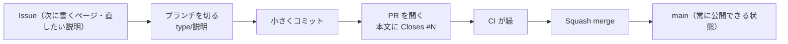

# コントリビューションガイド

このリポジトリでの作業の進め方。**運用は [awsdeploy](https://github.com/toshiki0102/awsdeploy)
から引き継いだ**（理由は [ADR-0001](./docs/adr/0001-port-dev-harness-from-awsdeploy.md)）。

## ブランチ戦略: GitHub Flow



**`main` へ直接コミット・push しない。** 必ずブランチを切って PR にする（pre-push フックが止める）。

## 作業の起点: Issue

**やること（書くページ・直したい説明・機能）は GitHub Issues が正。**

**Issue のラベルとブランチの `<type>` は同じ語彙**（`feat` `fix` `ci` `docs` `chore` `test`
`refactor`）。ラベルが `docs` なら `docs/<短い説明>` を切る — **Issue を見ればブランチ名が決まる。**

- **起票**: GitHub の New issue（テンプレート「作業（タスク）」）、`gh issue create --web`
  （ブラウザで開く）、または端末で `gh issue create --template task.md`。
  **対話できない場所から呼ぶときは `--title` と `--body` を渡す**（`gh` が聞き返せないため）。
- **PR 本文に `Closes #N` を書く**（N は Issue 番号）。マージで Issue が自動的に閉じる。
- **Issue を作らなくてよいもの**: その場で終わる小さな直し（1つの PR で完結する）。

## 手順

1. **ブランチを切る**（`main` を最新にしてから）
   ```bash
   git switch main && git pull
   git switch -c docs/agent-loop
   ```
2. **小さくコミットする**。メッセージは接頭辞付き（`feat:` `fix:` `ci:` `docs:` `chore:`
   `test:` `refactor:`）。
3. **push して PR を開く**。対応する Issue があれば本文に `Closes #N`。
4. **セルフレビュー**（差分を必ず読み返す）。
5. **Squash merge** で `main` に取り込む。`main` は「1変更 = 1コミット」の直線履歴。
6. **ブランチを削除**する（`gh pr merge <N> --squash --delete-branch`）。

## ブランチ命名規則

`<type>/<短い説明>`（ケバブケース）。`<type>` はコミット接頭辞・Issue ラベルと同じ語彙。

| 例 | 用途 |
|---|---|
| `docs/agent-loop` | ページを書く・直す |
| `feat/quiz-component` | サイトの機能 |
| `fix/broken-link` | 不具合の修正 |
| `chore/deps-bump` | 雑務・依存更新 |

## マージ方式: Squash merge（固定）

PR 内の途中経過コミットは1つに合成して `main` へ。マージコミットは作らない。

## セットアップ（クローン後1回だけ）

```bash
git config core.hooksPath .githooks   # フックを有効化
npm install                           # 依存（VitePress 導入後）
```

**フックの有効化を忘れると、秘密情報スキャンも main 保護も効かない。**

## ガードレール

| 仕組み | いつ | 何を防ぐ |
|---|---|---|
| **pre-commit** | `git commit` 時 | 秘密情報・個人情報の混入（`.githooks/checks/secret-pii-scan.sh`） |
| **pre-push** | `git push` 時 | `main` への直接 push |
| **pre-push** | `git push` 時 | `.specify/` · `.claude/skills/` を変えたのに ADR が無い状態 |
| **CI** | PR 時 | ビルドが壊れたままのマージ |
| **ブランチ保護** | `main` への push | サーバー側での強制（public リポジトリなので無料で使える） |

**このリポジトリは public なので、GitHub のブランチ保護（Ruleset）が無料で使える。**
awsdeploy では Private+Free のため使えず、クライアント側フックで代替していた。
