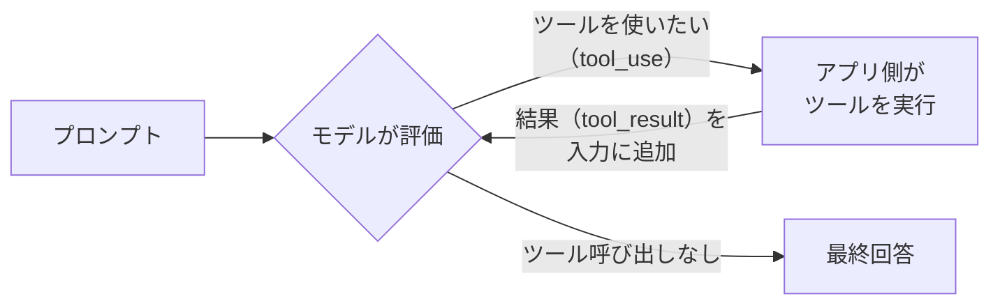

# エージェントループ（agentic loop）

> **要点**
> 1. エージェント＝「モデルが判断 → アプリがツールを実行 → 結果を入力に足して戻す」の**繰り返し**
> 2. **モデルは自分でコードを実行しない。** 「これを実行して」と構造化して頼むだけ
> 3. ループは、**応答にツール呼び出しが含まれなくなったら**終わる

## 1周（1ターン）で起きること

モデルはプロンプト・システムプロンプト・ツール定義・それまでの履歴を受け取り、
**文章で答えるか、ツールを呼ぶか**を判断する。ツールを呼ぶと決めたら、応答は
`stop_reason: "tool_use"` になり、ツール名と引数の入った `tool_use` ブロックが返る。

**実行するのはアプリ側**（Claude Code のようなハーネス）で、モデルではない。
アプリは結果を `tool_result` ブロックにして**会話に追加し、もう一度モデルに送る**。
この「実行結果が次の入力になる」ことで、モデルは結果を見て次の手を変えられる。

## いつ終わるか

ループの実体は `stop_reason == "tool_use"` の間だけ回る while ループ。
モデルが**ツールを呼ばずに**応答したら（`end_turn` など）、それが最終回答になる。
つまり「終わり」を決めるのはタイマーでも回数でもなく、**モデルの応答の形**。

簡単な質問なら1〜2ターン、複雑なタスクなら数十ターン続くこともある。

---

最終確認: **2026-09-12**

出典:

- [How the agent loop works — Agent SDK](https://code.claude.com/docs/en/agent-sdk/agent-loop)（ループの5段階と終了条件）
- [How tool use works — Claude API](https://platform.claude.com/docs/en/agents-and-tools/tool-use/how-tool-use-works)（`stop_reason` の契約と、モデルは実行しないこと）
