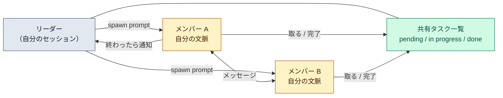

# エージェントチーム（agent teams）

::: tip 要点
1. チーム＝**複数の Claude Code セッションが対等に並走する**仕組み。1つがリーダー、残りがメンバー。各自が**自分のコンテキストウィンドウ**を持ち、メッセージで直接やりとりする
2. [サブエージェント](../internals/subagents.md)との違いは「結果を返して終わり」か「会話し続けるか」。メンバーは共有のタスク一覧から自分で仕事を取り、互いの結論に反論できる
3. 費用は**人数にほぼ比例**する（各自が別の Claude インスタンス）。研究・レビュー・仮説の競争には見合う。順番に進む作業や同じファイルの編集には向かない。実験的機能で、既定では無効
:::

## サブエージェントと何が違うか

| | サブエージェント | エージェントチーム |
|---|---|---|
| 文脈 | 自分の文脈。結果は呼び元へ | 自分の文脈。完全に独立 |
| 連絡 | 結果を返す | メンバー同士が直接メッセージ |
| 調整 | 親がすべて管理 | メッセージと共有タスク一覧で自己調整 |
| 向くもの | 結果だけ要る集中作業 | 議論と協力が要る複雑な作業 |
| 費用 | 低い（要約だけ親に戻る） | 高い（各自が別のインスタンス） |

サブエージェントは「調べて要約を返す」道具。チームは「別々の角度で調べて、互いに反論し合う」道具。
公式が挙げる強い使い方は、並列レビュー（安全性・性能・テストを別々のメンバーに）、
競合する仮説でのデバッグ（5人に別の仮説を持たせて互いに反証させる）、層をまたぐ変更の分担。

## どう動くか

- `CLAUDE_CODE_EXPERIMENTAL_AGENT_TEAMS=1` で有効化。**既定では無効**。対話セッションでだけ動く（`-p` では作られない）
- 「3人のメンバーを立てて…」と自然言語で頼む。リーダーがメンバーを起動し、仕事を割り、結果を統合する
- メンバーは起動時に**プロジェクトの文脈**（CLAUDE.md、MCP、スキル）と**リーダーからの指示**を読む。**リーダーの会話履歴は引き継がない**ので、必要な事情は指示に書く
- 共有タスク一覧はリーダーが作り、メンバーが取る。依存関係のあるタスクは前が終わるまで取れない
- 許可のプロンプトはリーダーの画面に上がってくる。メンバー同士のメッセージは「別のセッションから来た」と伝えられ、許可の代理にはならない

## 使いどころと注意

- **人数は3〜5人から。** 費用は線形に増え、調整の手間も増える。3人の集中したメンバーは5人の散ったメンバーに勝つ
- **同じファイルを2人に触らせない。** 上書きし合う。ファイルの持ち分を分ける
- **タスクは自己完結の粒度に。** 関数1つ、テスト1ファイル、レビュー1本
- 初めてなら、コードを書かない仕事（PR レビュー、ライブラリ調査、バグ調査）から
- 制限: `/resume` でメンバーは戻らない、チームは1セッション1つ、メンバーは自分のチームを作れない

## 自分で確かめる

- 入力欄の下の agent panel にメンバーが並ぶ。矢印で選んで Enter で会話を見る、直接指示もできる
- `Ctrl+T` で共有タスク一覧
- 並列の他の選択肢: [ワークツリー](./worktrees.md)（自分で複数セッションを回す）、サブエージェント（1セッションの中で分ける）

---

最終確認: **2026-09-13**

出典:

- [Orchestrate teams of Claude Code sessions — Claude Code](https://code.claude.com/docs/en/agent-teams)（サブエージェントとの比較表、有効化、メンバーが読むもの、共有タスク一覧、許可の扱い、費用、人数の目安、制限）
