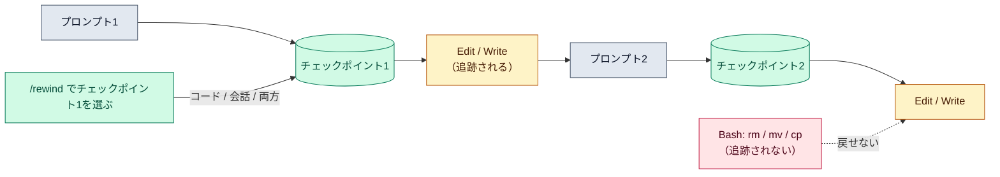

# チェックポイント（巻き戻し）

::: tip 要点
1. チェックポイント＝**ターンを始めるプロンプトを送るたびに、Claude Code が自動で取るコードの状態**。`/rewind`（または空欄で `Esc` 2回）で、そこまで戻れる
2. 戻せるのは **Claude のファイル編集ツールで変えたもの**だけ。`rm` `mv` `cp` など **Bash で変えたもの、サブエージェントの編集、自分が外で変えたもの**は戻らない
3. **git の代わりではない。** セッション内の素早い復旧用。恒久的な履歴と共有は git に任せる
:::

## いつ取られ、何が戻るか

**ターンを始めるプロンプトを送るたび**に1つチェックポイントができる。Claude のファイル編集ツール
（Edit / Write など）が変えたファイルのスナップショットを、直近100個ぶん持つ。チェックポイントは
[セッション](./sessions.md)と一緒に保存されるので、再開したあとでも `/rewind` できる。
スナップショットは既定で約30日で消える。

`/rewind` を開くと、送ったプロンプトの一覧が出る。1つ選んで、どう戻すかを決める。

| 選択肢 | 起きること |
|---|---|
| コードと会話を戻す | 両方をその時点へ |
| 会話だけ戻す | コードは今のまま、会話をそこまで巻き戻す。元のプロンプトが入力欄に戻る |
| コードだけ戻す | 会話は残し、ファイルの変更だけ取り消す |
| ここから要約 / ここまで要約 | 戻さずに、その範囲を要約して[文脈](../internals/context-window.md)を空ける |

## 戻らないもの

- **Bash が変えたファイル。** `rm file.txt`、`mv old new`、`cp a b` は追跡されない
- **サブエージェントの編集。** 多くの場合は捕捉されない。戻すなら git で
- **セッションの外の変更。** 自分が手で直したものや、別セッションの編集
- **途中で割り込んだメッセージ。** ターンの途中で届いたメッセージにはチェックポイントが無い。そのターンの先頭に戻す

## git とどう使い分けるか

チェックポイントは「いま試したことをすぐ戻す」ための道具。別の進め方を試す、バグを入れてしまった
変更を取り消す、といった**セッション内の復旧**に向く。コミット・ブランチ・長期の履歴は git のまま。
別の進め方を**残したまま**試すなら、巻き戻しでなく `/branch`（[セッションの分岐](./sessions.md)）を使う。

## 自分で確かめる

- 入力欄が空の状態で `Esc` を2回、または `/rewind`
- 要約の選択肢では、矢印キーで合わせて「何を残すか」の指示を打ち込める
- `/clear` した前の会話に戻るなら、`/rewind` の一覧の先頭に出る「previous session」を選ぶ

---

最終確認: **2026-09-13**

出典:

- [Checkpointing — Claude Code](https://code.claude.com/docs/en/checkpointing)（いつ取られるか、`/rewind` の選択肢、100個の上限、再開後も使えること、追跡されないもの、git との関係）
