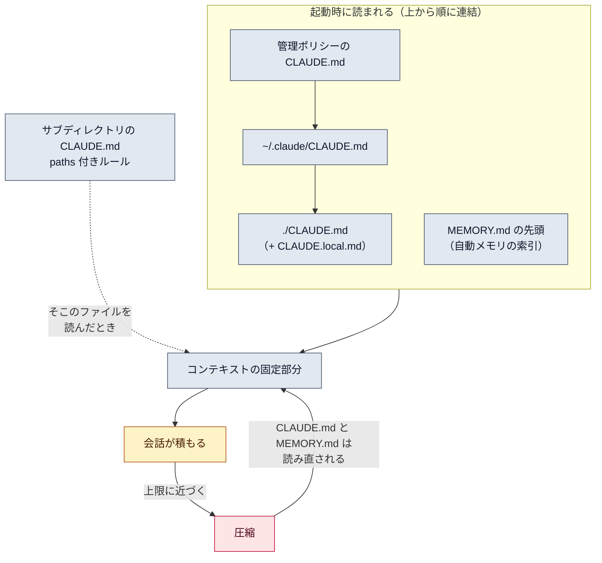

# CLAUDE.md とメモリ

::: tip 要点
1. セッションは毎回まっさら。次に持ち越せるのは **CLAUDE.md（自分が書く指示）** と **自動メモリ（Claude が書く学び）** の2つだけ
2. CLAUDE.md は起動時に「広い範囲 → 作業ディレクトリ」の順に**全部つながって**入り、**圧縮のあとも読み直される**。だから「ずっと守るルール」はここ
3. どちらも**指示であって強制ではない**。必ず止めたいことはフック、長い手順はスキルに逃がす
:::

## 2つの仕組みの違い

| | CLAUDE.md | 自動メモリ |
|---|---|---|
| 誰が書く | 自分 | Claude |
| 中身 | 指示とルール | 学び（好み・訂正・プロジェクトの事情） |
| 置き場 | プロジェクト / ユーザー / 組織 | リポジトリごと（`~/.claude/projects/<project>/memory/`） |
| いつ読まれる | 毎セッション | 毎セッション（`MEMORY.md` の先頭だけ。詳細は必要なとき） |
| 向いているもの | ビルドコマンド・規約・「必ず X する」 | 自分の好み、同じ訂正を2回した事柄 |

**何をどこに書くか**は、これで決まる。毎回守るルール → CLAUDE.md。自分の好みや訂正 →
自動メモリ（「覚えて」と言えば Claude が書く）。長い手順 → スキル。**必ず止めたい操作 → フック**。

## CLAUDE.md はどこから読まれるか

| 範囲 | 場所 | 誰と共有 |
|---|---|---|
| 組織 | 管理ポリシーの置き場（OS ごとに固定） | 全員 |
| ユーザー | `~/.claude/CLAUDE.md` | 自分の全プロジェクト |
| プロジェクト | `./CLAUDE.md` または `./.claude/CLAUDE.md` | チーム（git 経由） |
| ローカル | `./CLAUDE.local.md`（`.gitignore` に入れる） | 自分の、このプロジェクトだけ |

上書きではなく**連結**される。作業ディレクトリに近いものほど**あとに**読まれる。
サブディレクトリの CLAUDE.md は起動時ではなく、**そこのファイルを読んだとき**に入る。
`@path` で他のファイルを取り込めるが、起動時に展開されるので文脈は減らない。目安は1ファイル200行。

## 圧縮を生き残る理由と限界

CLAUDE.md は毎リクエスト差し込まれるので、[圧縮](../internals/context-window.md)で会話が要約に
置き換わっても、`/compact` のあと**ディスクから読み直される**。会話の中で言っただけの指示は
要約に埋もれて消えうる。「あとで忘れられた」と感じたら、それは CLAUDE.md に書くべきだった指示。

ただし CLAUDE.md も自動メモリも、**Claude が読む文脈であって、強制する設定ではない**。
曖昧な指示や矛盾する指示は守られないことがある。「コミット前に必ずテスト」のように
決まった時点で必ず走らせたいことは、[フック](https://code.claude.com/docs/en/hooks-guide)に書く。

## 自分で確かめる

- `/memory` — CLAUDE.md と自動メモリの一覧。選ぶとエディタで開ける
- `/context` — 「Memory files」に、このセッションで実際に読まれたファイルが出る
- `/init` — プロジェクトの CLAUDE.md の雛形を Claude に作らせる

---

最終確認: **2026-09-13**

出典:

- [How Claude remembers your project — Claude Code](https://code.claude.com/docs/en/memory)（2つの仕組みの比較表、読み込み順、圧縮後の再読込、`/memory` `/context` `/init`）
- [Explore the context window — Claude Code](https://code.claude.com/docs/en/context-window)（圧縮後に読み直されるもの）
