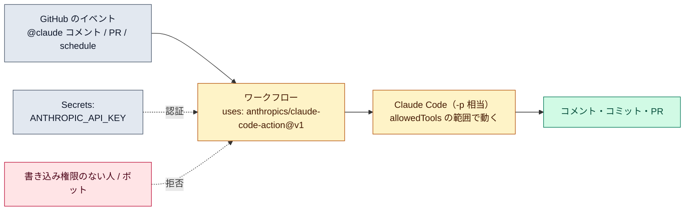

# GitHub Actions で動かす

::: tip 要点
1. `claude-code-action` を使うと、**Issue や PR のコメントで `@claude` と呼ぶだけで、CI の中で Claude Code が動いて変更を push する**。`prompt` を書けば、PR が開いたときや毎朝など**イベント起点で自動実行**もできる
2. 中身は[非対話モード](./headless.md)と同じループ。**答える人がいない**ので、使えるツールは `claude_args` の `--allowedTools` で先に決める。既定では書き込み権限のある人のコメントだけに反応し、ボットは拒否する
3. 認証情報は **GitHub Secrets** に。ワークフローには必要最小限の権限だけ渡し、Claude の変更はマージ前に人が見る
:::

## 何が起きているか

`.github/workflows/claude.yml` に `anthropics/claude-code-action@v1` を書く。動き方は2つで、
ワークフローの書き方で自動的に決まる。

| モード | 条件 | 動き |
|---|---|---|
| 対話 | `prompt` を書かない | Issue / PR のコメントやレビュー、新しい Issue の本文に `@claude` があれば応答。進捗と結果はそのコメントに |
| 自動 | `prompt` を書く | イベントが起きたら黙って実行。結果は既定でワークフローのログに。スキルも `/name` で渡せる |

どちらも、起動する人には**書き込み権限**が要り、**ボットは `allowed_bots` に書かない限り拒否**される
（Claude 同士がループしないため）。

## 権限と認証

- **認証**: `ANTHROPIC_API_KEY`（API キー）か `CLAUDE_CODE_OAUTH_TOKEN`（サブスクリプションのトークン、`claude setup-token` で作る）を **Secrets** に置く。ワークフローに直接書かない
- **GitHub 側の権限**: ワークフローの `permissions` に `contents` `pull-requests` `issues` の write と、`id-token: write`（アクションの認証に必要）
- **Claude 側の権限**: [非対話モード](./headless.md)と同じで、答える人がいない。`claude_args: '--allowedTools "Bash(npm test *),Read,Edit"'` のように**先に許可**する。何も渡さなければ、シェルも GitHub API も使えない

CLAUDE.md はここでも読まれる。コーディング規約やレビュー基準を書いておくと、PR の作り方に効く。

## 費用と安全

- 費用は2種類。GitHub Actions の実行時間と、API のトークン。`--max-turns` で回数を、ワークフローの timeout で時間を抑える
- 公開リポジトリでは、fork からの PR には Secrets が渡らない。レビューが動くのは同じリポジトリのブランチからの PR だけ
- **Claude の変更はマージ前に人が見る。** 権限は必要最小限。組織で配るなら、共有 Secrets か OIDC 連携（長期の鍵を置かない）

## 自分で確かめる

- Claude Code の中で `/install-github-app` を実行すると、App の導入・Secret の登録・ワークフローの PR 作成まで案内される（github.com のリポジトリのみ）
- 導入後、Issue に `@claude この機能を実装して` と書いて、コメントが更新されるのを見る
- レビューだけを自動化したいなら、ワークフローを書かずに済む Code Review 機能もある

---

最終確認: **2026-09-13**

出典:

- [Claude Code GitHub Actions — Claude Code](https://code.claude.com/docs/en/github-actions)（導入の2つの方法、対話／自動モード、起動できる人の条件、Secrets と権限、`claude_args`、費用、fork の扱い）
