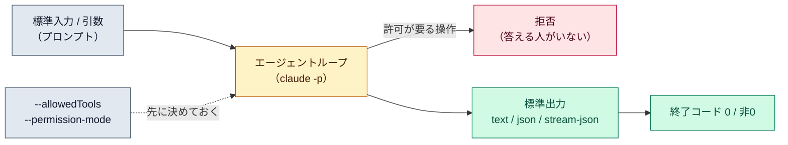

# 非対話モード（`claude -p`）

::: tip 要点
1. `claude -p "指示"` は**1回走って結果を返して終わる**。標準入力から流し込めて、標準出力に返るので、CI やスクリプトの中で普通のコマンドのように使える
2. **答える人がいない。** 許可が要る操作は拒否されるので、通したい操作は `--allowedTools` か `--permission-mode` で先に決める。`--output-format json` で結果・セッション ID・費用が構造化して返る
3. CI では `--bare` を付ける。フック・スキル・CLAUDE.md・MCP・自動メモリの自動読み込みを飛ばし、**どのマシンでも同じ結果**になる。`-p` のセッションは一覧には出ないが、ID があれば再開できる
:::

## 何が起きているか

`-p`（`--print`）を付けると、[エージェントループ](./agent-loop.md)は同じまま、**画面の対話が無くなる**。
プロンプトは引数か標準入力から入り、結果は標準出力に出て、成功なら終了コード 0、失敗なら非0で
終わる。`git diff main | claude -p "この差分の誤字を報告して"` のように、パイプの一段として使える。

出力の形は3つ。

| `--output-format` | 返るもの |
|---|---|
| `text`（既定） | 結果の文章 |
| `json` | 結果、セッション ID、使用量と費用の見積もり |
| `stream-json` | 1行1イベントの JSON。途中経過をリアルタイムに読める |

## 許可はどうなるか

**答える人がいない。** `-p` の開始モードはどのプランでも default なので、許可を求める操作は
そのまま拒否される。通したい操作は先に決める。

- `--allowedTools "Read,Edit,Bash(git diff *)"` で個別に許可（[ルールの書式](./permission-modes.md)と同じ）
- `--permission-mode acceptEdits` や `auto` で基準線を上げる。`dontAsk` は「聞く代わりに拒否」を明示する
- `--dangerously-skip-permissions` は隔離されたコンテナの中だけ

CLAUDE.md や[フック](../internals/hooks.md)は、`--bare` を付けない限り対話のときと同じように
読まれ、走る。信頼していないフォルダでも確認なしに走るので、CI では次の `--bare` を使う。

## CI では `--bare`

`--bare` はフック・スキル・サブエージェント・プラグイン・MCP・自動メモリ・CLAUDE.md の
**自動読み込みを飛ばす**。同僚の `~/.claude` にあるフックや、プロジェクトの `.mcp.json` が
結果を変えない。必要なものは `--append-system-prompt`、`--settings`、`--mcp-config` で明示して渡す。
認証は `ANTHROPIC_API_KEY`（サブスクリプションのログインは使われない）。

## 自分で確かめる

- `claude -p "この README を3行で要約して" --output-format json | jq -r .result`
- 続きは `claude -p "..." --continue`。複数走らせるなら JSON の `session_id` を取って `--resume`
- `-p` のセッションは `claude --resume` の一覧に出ない。ID を渡せば再開できる

---

最終確認: **2026-09-13**

出典:

- [Run Claude Code programmatically — Claude Code](https://code.claude.com/docs/en/headless)（`-p` の基本、終了コード、出力形式、許可の扱い、`--bare`、`--continue` / `--resume`）
- [Manage sessions — Claude Code](https://code.claude.com/docs/en/sessions)（`-p` のセッションが一覧に出ないこと）
