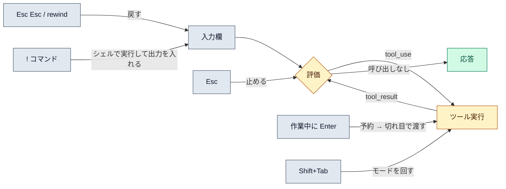

# 対話モードの操作

::: tip 要点
1. キー操作は**ループのどこに効くか**で覚える。`Esc` はいまのターンを止める、`Shift+Tab` は[パーミッションモード](./permission-modes.md)を回す、`Esc` 2回は[巻き戻し](./checkpointing.md)、`Ctrl+O` は転記（思考も含む）を開く
2. 作業中に打ったメッセージは**割り込まず予約**される。ツール呼び出しの切れ目で同じターンに渡り、ターンが終われば次のターンになる。止めたければ `Esc`
3. 先頭の記号で入力の種類が変わる。**`!` は自分のシェルで実行して出力を会話に入れる**、`@` はファイルパスの補完、`/` はコマンドとスキル
:::

## ループに効くキー

| キー | 何をするか | ループのどこに効くか |
|---|---|---|
| `Esc` | いまの Claude を止める。ダイアログを閉じる | 進行中のターンを中断 |
| `Esc` `Esc` | 入力欄が空なら[巻き戻し](./checkpointing.md)メニュー。文字があれば消す | 会話とコードを前の時点へ |
| `Shift+Tab` | [パーミッションモード](./permission-modes.md)を回す（default → acceptEdits → plan） | ツール実行前の関所 |
| `Ctrl+O` | 転記ビューア。折り畳まれたツール呼び出しや[思考](./thinking-effort.md)を見る | 何が起きたかの確認 |
| `Option+T` / `Alt+T` | 拡張思考のオン／オフ | 評価の深さ |
| `Ctrl+B` | 走っているタスクをバックグラウンドに | 長いコマンドを待たない |
| `Ctrl+G` | 入力を外部エディタで書く | 長いプロンプト |
| `Ctrl+T` | タスク一覧の表示 | 進捗の確認 |

## 作業中に打つと何が起きるか

Claude が作業中にメッセージを打って `Enter` を押すと、**中断せず予約**される。入力欄の上に並び、
ツール呼び出しが終わった切れ目で**同じターンの中で**渡される。ターンが終わった時点で残っていれば、
いちばん古いものが次のターンになる。

すぐ渡したいなら `Esc` で止める。予約したものは消えず、そのまま送られる。取り消すなら、入力欄の
先頭行で `Up` を押すと予約が入力欄に戻る。`/model` `/effort` `/fast` は予約されず即座に効く。

## 先頭の記号

| 先頭 | 意味 |
|---|---|
| `!` | **シェルモード。** 自分のシェルでコマンドを実行し、出力を会話に入れて Claude に応答させる。Claude にコマンドを頼むのではなく、自分で走らせて結果だけ渡す |
| `@` | ファイルパスの補完。ファイルを Claude に見せる |
| `/` | コマンドとスキルの一覧 |
| `\` + `Enter` | 改行（複数行の入力） |

`!` は[パーミッション](./permission-modes.md)を通らない。自分のシェルで自分が走らせているから。
このサイトの作業で「マージは本人が `! gh pr merge` で実行する」のはその使い方。

## 自分で確かめる

- `Ctrl+R` で過去の入力を検索
- `/btw 質問` で、いまのターンを止めずに横で聞ける
- `/diff` でこのセッションの変更をまとめて見る

---

最終確認: **2026-09-13**

出典:

- [Interactive mode — Claude Code](https://code.claude.com/docs/en/interactive-mode)（キーボードショートカットの表、複数行入力、`!` シェルモード、`@` 補完、作業中のメッセージの予約と送られるタイミング、`/btw`）
