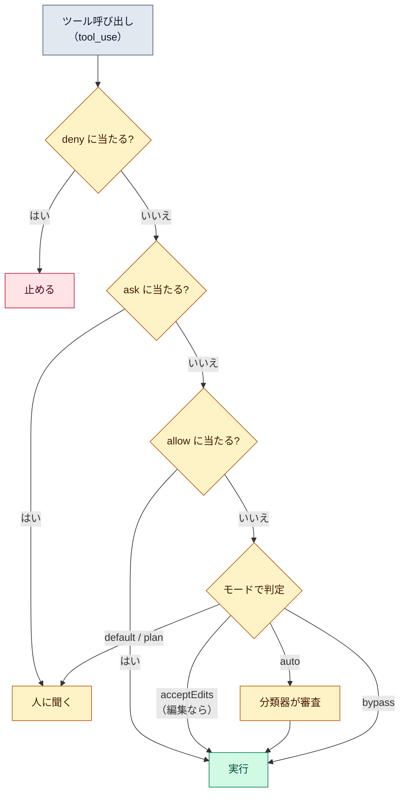

# パーミッションモード（permission mode）

::: tip 要点
1. モード＝**「聞かずにやってよい範囲」の基準線**。default は読むだけ、acceptEdits は編集まで、plan は編集しない、auto は別のモデルが審査、bypass は全部
2. 判定は**ルールが先、モードは後**。deny → ask → allow の順で最初に当たったものが勝ち。**deny はどのモードでも効く**（bypass でも）
3. 権限を決めるのは Claude Code であって、モデルではない。**CLAUDE.md に「〜するな」と書いても権限は変わらない。** 変えるならルールかフック
:::

## モードは基準線

| モード | 聞かずにやること | 向く場面 |
|---|---|---|
| `default`（Manual） | 読むだけ | 1つずつ自分で見たいとき |
| `acceptEdits` | 読む＋作業ディレクトリ内のファイル編集と `mkdir` `mv` `cp` など | 差分を見ながら反復するとき |
| `plan` | 読む。編集はしない | 変更前にコードを調べさせるとき |
| `auto` | 全部。ただし別のモデル（分類器）が審査 | 長いタスク、確認疲れを減らしたいとき |
| `dontAsk` | 読む＋事前に許可したもの。それ以外は**聞かずに拒否** | CI やスクリプト |
| `bypassPermissions` | 全部。審査なし | コンテナや VM の中だけ |

2026-09-13 時点、Pro / Max / Team では `auto` が既定の開始モード。

## ルールが先、モードは後

モードは基準線で、その上に**ルール**を重ねる。ルールは `settings.json` の `permissions` か
`/permissions` で書く（例: `Bash(npm test *)`、`Read(./.env)`）。

- 評価順は **deny → ask → allow**。最初に当たったルールで決まり、ルールの細かさで順は変わらない
- **deny はどのモードでも効く。** `bypassPermissions` でも止まる
- allow は `bypassPermissions` では意味がない（もともと全部通る）
- どのルールにも当たらなければ、モードの基準線で決まる

**ルールを守らせているのは Claude Code で、モデルではない。** プロンプトや CLAUDE.md に書いた
「〜するな」はモデルの振る舞いを変えるだけで、Claude Code が通す／止めるの判定には入らない。
確実に止めるならルールか、実行前に走る[フック](https://code.claude.com/docs/en/hooks-guide)。

## auto と bypass の違い

`auto` は人の代わりに**分類器（別のモデル）**が各操作を見て、依頼の範囲を超える操作、
見慣れないインフラへの操作、読んだ内容に操られたように見える操作を止める。連続3回か
合計20回止めると、`auto` を一時停止して人に聞く方式に戻る。

`bypassPermissions` は審査そのものが無い。隔離された環境（コンテナ・VM）専用で、
root では起動を拒否し、**始めてから途中で入ることはできない**（起動時にフラグか設定で指定）。

## 自分で確かめる

- `Shift+Tab` — セッション中にモードを切り替える（`default` → `acceptEdits` → `plan` の循環）。状態バーに今のモードが出る
- `/permissions` — 効いているルールと、どの設定ファイル由来かの一覧
- 起動時は `claude --permission-mode <mode>`、毎回の既定は設定ファイルの `permissions.defaultMode`

---

最終確認: **2026-09-13**

出典:

- [Choose a permission mode — Claude Code](https://code.claude.com/docs/en/permission-modes)（6モードの表、auto の分類器と一時停止、bypass の制約、切り替え方）
- [Configure permissions — Claude Code](https://code.claude.com/docs/en/permissions)（deny → ask → allow の評価順、ルールの書式、「ルールを守らせるのは Claude Code でありモデルではない」）
