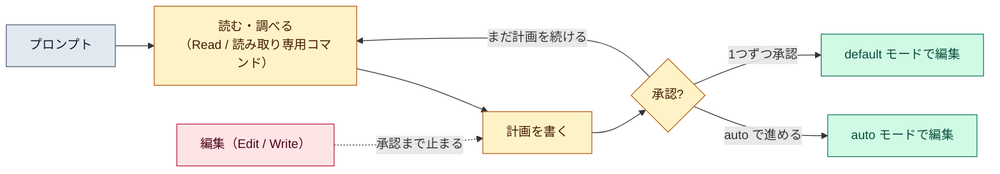

# プランモード（plan mode）

::: tip 要点
1. プランモード＝**読んで、調べて、計画を書くまで**。ソースは編集しない。編集は計画を承認するまで止まる
2. 承認の選択肢がそのまま次のモードになる。**「auto で進める」「編集を1つずつ承認する」「まだ計画を続ける」**の3つ。承認するとプランモードを抜ける
3. 入り方は3つ。`Shift+Tab` で切り替え、**`/plan` を先頭に付けて1回だけ**、`--permission-mode plan` で起動
:::

## 何ができて、何ができないか

プランモードの Claude は**ファイルを読み、調べるためにシェルコマンドを走らせ、計画を書く**。
ソースファイルの編集はしない。auto モードが使える環境では、調べるためのコマンドを分類器が
審査して通す。使えない環境では、読み取り専用の組み込みコマンド以外は聞かれる。

つまり[パーミッションモード](./permission-modes.md)の中で「編集だけを止めた」状態。
読むほうは普段どおり動く。

## 承認すると何が起きるか

計画ができると Claude が示し、どう進めるかを聞く。

| 選択肢 | 起きること |
|---|---|
| **Yes, and use auto mode** | 承認して auto モードへ。auto が使えない環境では「auto-accept edits」（acceptEdits） |
| **Yes, manually approve edits** | 承認して default モードへ。編集を1つずつ見る |
| **No, keep planning** | プランモードのまま。直してほしい点を伝える |

**承認するとプランモードを抜け、選んだモードに切り替わって編集が始まる。** もう一度計画したければ
`Shift+Tab` で戻るか、次のプロンプトに `/plan` を付ける。`Ctrl+G` で計画をエディタで開いて
直接書き換えてから進めることもできる。

書いた計画は[圧縮](../internals/context-window.md)のあともディスクから読み直される。
長い実装の途中で計画が消えることはない。

## いつ使うか

変更前にコードを調べさせたいとき。方向が違ったまま実装が進むと戻すのが高くつくので、
大きめの変更は計画で方向を合わせてから編集に入る。調査そのものは Plan サブエージェントに
任され、探索の出力は[別のコンテキスト](../internals/subagents.md)に溜まる。

## 自分で確かめる

- `Shift+Tab` を押していくと `default → acceptEdits → plan` と回る。状態バーに「plan mode on」
- 承認せずに抜けるなら、もう一度 `Shift+Tab`
- プロジェクトの既定にするなら `.claude/settings.json` の `permissions.defaultMode` を `plan` に

---

最終確認: **2026-09-13**

出典:

- [Choose a permission mode — Claude Code](https://code.claude.com/docs/en/permission-modes)（「Analyze before you edit with plan mode」「Review and approve a plan」「Set plan mode as the default」節）
- [Explore the context window — Claude Code](https://code.claude.com/docs/en/context-window)（計画が圧縮後に読み直されること）
