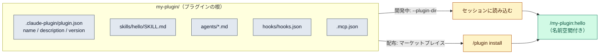

# プラグイン（plugins）

::: tip 要点
1. プラグイン＝**スキル・エージェント・フック・MCP サーバーなどをひとまとめにして配る単位**。`.claude/` に直接置くのは自分用、プラグインはチームや他人に渡す用
2. プラグインのスキルは**必ず名前空間付き**（`/プラグイン名:スキル名`）。同名のスキルがあっても衝突せず共存する。エージェントは逆で、プロジェクトや自分の `.claude/agents/` のほうが同名のプラグイン版に勝つ
3. 作るときは `claude --plugin-dir ./my-plugin` で試し、`/reload-plugins` で読み直す。配るときはマーケットプレイスに載せ、使う側は `/plugin` で入れる
:::

## 何が起きているか

[スキル](./skills.md)、[サブエージェント](../internals/subagents.md)、[フック](../internals/hooks.md)、[MCP](../internals/mcp.md) は
それぞれ `.claude/` の下に置けば動く。だがそれは**このプロジェクトの中だけ**。他のプロジェクトや
チームに渡すには、まとめて配る単位が要る。それがプラグイン。

| やり方 | スキルの名前 | 向いているもの |
|---|---|---|
| `.claude/` に直接置く | `/hello` | 個人の作業、プロジェクト固有、素早い試行 |
| プラグイン | `/my-plugin:hello` | チームに配る、公開する、版を付ける、複数プロジェクトで再利用 |

公式の勧めは「まず `.claude/` で作り、配りたくなったらプラグインに変換する」。

## 中身の置き方

プラグインは1つのディレクトリ。`.claude-plugin/plugin.json` に名前・説明・版を書き、
**それ以外はプラグインの根に**置く（`.claude-plugin/` の中に入れるのが典型的な間違い）。

| 場所 | 中身 |
|---|---|
| `skills/<name>/SKILL.md` | スキル。`/プラグイン名:name` になる |
| `agents/` | サブエージェントの定義 |
| `hooks/hooks.json` | フック。`settings.json` の `hooks` と同じ形 |
| `.mcp.json` | MCP サーバー |
| `.lsp.json` | 言語サーバー（コードの意味を引く補助） |

`plugin.json` の `name` がそのまま名前空間になる。スキルは常に名前空間付きなので、
元の `/hello` とプラグイン版の `/my-plugin:hello` は**両方残る**。エージェントは違い、
プロジェクトやユーザーの `.claude/agents/` にある同名の定義がプラグイン版に勝つ。

## 作る・試す・配る

- **試す**: `claude --plugin-dir ./my-plugin`。直したら `/reload-plugins`。同名の導入済みプラグインがあれば、そのセッションではローカル版が勝つ
- **配る**: マーケットプレイスに載せる。Anthropic の公式マーケットプレイスと、審査を経て載るコミュニティ版がある。チーム内だけなら非公開リポジトリで自前のマーケットプレイスを持てる
- **入れる**: `/plugin` で探して導入。導入範囲はユーザー／プロジェクトなどを選べる

このサイトで使っている Spec Kit や superpowers も、こうして配られたプラグイン。

## 自分で確かめる

- `/plugin` で入っているプラグインと、その Errors タブ
- `/help` の「Custom commands」に、名前空間付きのスキルが並ぶ
- 公開前に `claude plugin validate ./my-plugin` で構造を検査できる

---

最終確認: **2026-09-13**

出典:

- [Create plugins — Claude Code](https://code.claude.com/docs/en/plugins)（`.claude/` との使い分け、`plugin.json`、ディレクトリ構成、名前空間、`--plugin-dir` と `/reload-plugins`、エージェントとスキルの上書き規則、マーケットプレイス）
