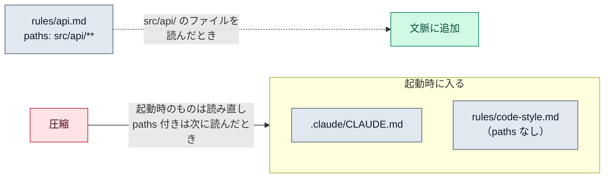

# ルール（`.claude/rules/`）

::: tip 要点
1. ルール＝**CLAUDE.md を話題ごとのファイルに分けたもの**。`.claude/rules/` に置き、1ファイル1話題。`paths` の無いルールは `.claude/CLAUDE.md` と同じ扱いで起動時に入る
2. `paths` を付けると**そのパターンに合うファイルを Claude が読んだときだけ入る**。毎ターンではない。だから API の規約は `src/api/**` を読んだときにだけ文脈を使う
3. 使い分け: **毎回守る事実 → CLAUDE.md、場所が決まった規約 → `paths` 付きルール、呼んだときだけの手順 → スキル**。ユーザー用の `~/.claude/rules/` はプロジェクトのルールより先に読まれ、プロジェクトが勝つ
:::



## 何が起きているか

[CLAUDE.md](./claude-md-memory.md) が長くなると、どの作業でも全文が入り、守られにくくなる（目安は200行）。
ルールはそれを**話題ごとのファイルに分ける**仕組み。`.claude/rules/` の下の `.md` を再帰的に拾い、
`testing.md`、`api-design.md` のように1ファイル1話題で書く。

`paths` の無いルールは、`.claude/CLAUDE.md` と**同じ優先度で起動時に**入る。分けただけで、読まれ方は同じ。

## `paths` で読まれる場所を絞る

frontmatter に `paths` を書くと、**そのパターンに合うファイルを Claude が読んだとき**に初めて入る。

```markdown
---
paths:
  - "src/api/**/*.ts"
---
# API の規約
- すべてのエンドポイントに入力検証を付ける
```

glob の形は `**/*.ts`（全 TypeScript）、`src/**/*`（src 以下すべて）、`*.md`（直下の Markdown）など。
`{ts,tsx}` のような展開も使える。**ツールを呼ぶたびに評価されるのではなく、該当ファイルを読んだとき**。
だから API を触らないセッションでは、API の規約は一度も[コンテキスト](../internals/context-window.md)を使わない。

## 何をどこに書くか

| 置き場 | いつ入るか | 向いているもの |
|---|---|---|
| CLAUDE.md | 毎リクエスト | 毎回守る事実。ビルドコマンド、全体の規約 |
| ルール（`paths` なし） | 起動時 | CLAUDE.md の分割。話題ごとに整理したいとき |
| ルール（`paths` あり） | 該当ファイルを読んだとき | 場所が決まった規約。API、テスト、フロントエンド |
| [スキル](./skills.md) | 呼んだときだけ | 手順。毎回要らない参照資料 |

[圧縮](../internals/compaction.md)のあと、起動時に入ったルールは読み直されるが、`paths` 付きは
次に該当ファイルを読むまで戻らない。「圧縮後に規約を忘れた」ように見えるのはこのため。

## 自分で確かめる

- ユーザー用は `~/.claude/rules/`。全プロジェクトに効き、プロジェクトのルールより先に読まれる（プロジェクトが勝つ）
- 共有したいルールは symlink で持ち込める。ただし作業ディレクトリの外を指すものは外部インポートとして承認が要る
- `/context` の「Memory files」に、このセッションで読まれたルールが出る

---

最終確認: **2026-09-13**

出典:

- [How Claude remembers your project — Claude Code](https://code.claude.com/docs/en/memory)（「Organize rules with .claude/rules/」節。置き場、`paths` の挙動と glob、ユーザー用ルールの順序、スキルとの使い分け、圧縮後の扱い）
