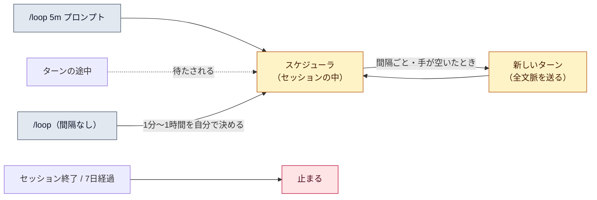

# スケジュールタスクと `/loop`

::: tip 要点
1. `/loop 5m デプロイを確認して` で、**セッションの中で決めた間隔でプロンプトを繰り返す**。間隔を省くと Claude が状況を見て1分〜1時間の待ち時間を自分で決める
2. 動くのは**Claude Code が起動していて手が空いているとき**だけ。ターンの途中には割り込まず、閉じれば止まる。1回動くたびに**全文脈を送って1ターン使う**ので、放置中でも費用がかかる
3. 繰り返しタスクは**7日で自分で消える**。止めるのは `Esc`（自動ペースのもの）か「タスクを消して」。マシンや画面を閉じても動かしたいなら、クラウドの Routines か GitHub Actions
:::

## 何が起きているか

`/loop` は、プロンプトを cron の形に変えてセッション内のスケジューラに登録する。スケジューラは
毎秒「期限のタスク」を見て、**Claude が手空きのとき**に低い優先度で新しいターンとして投入する。
ターンの途中なら、その終わりまで待つ。詰まっている間に何回分か期限が過ぎても、追いつき実行はしない（1回だけ）。

| 書き方 | 起きること |
|---|---|
| `/loop 5m CI を見て` | 5分ごとに固定で走る |
| `/loop CI を見て` | Claude が毎回、次の待ち時間を1分〜1時間で決める。静かなら長く待つ |
| `/loop` | 組み込みの「保守」プロンプト（未完の作業の続き、PR の面倒、片付け）を自分のペースで |

スキルも渡せる（`/loop 20m /review-pr 1234`）。1回きりの予約は「15時にリリースブランチを push するよう思い出させて」と頼めばよい。

## 費用と寿命

- 1回動くたび、[コンテキスト](../internals/context-window.md)全部を送って1ターン使う。**放置中でも同じ**。長いセッションで回すほど1回が重い（[コストの内訳](../internals/costs.md)）
- 繰り返しタスクは**作成から7日で失効**。最後に1回動いて自分で消える。忘れたループが回り続けない
- タスクは**セッションに紐づく**。新しい会話を始めると消える。`--resume` では失効していないものが戻るが、自動ペースの `/loop` は戻らない（もう一度打つ）
- 同じ壁時計の瞬間に全員が API を叩かないよう、発火時刻には固定のずれが入る

## 止め方と他の選択肢

- 自動ペースの `/loop` は `Esc` で次の起床を取り消す。固定間隔のものは「deploy check を消して」と頼む（内部では `CronDelete`）
- 「どんな予約がある？」で一覧（`CronList`）。1セッション50個まで
- **画面を閉じても動かしたい**なら別の仕組み。クラウドの Routines（マシン不要、1時間以上）、Desktop の予約タスク（ローカル、画面不要）、[GitHub Actions](./github-actions.md)（CI の `schedule`）

## 自分で確かめる

- `/loop 1m 時刻を言って` で1分後に動くのを見る。終わったら「消して」
- 出来事に反応したいだけなら、ポーリングより Monitor ツールやチャンネルのほうが軽い

---

最終確認: **2026-09-13**

出典:

- [Run prompts on a schedule — Claude Code](https://code.claude.com/docs/en/scheduled-tasks)（`/loop` の3つの形、動くタイミング、7日の失効、止め方、`CronCreate` などのツール、クラウド／Desktop との比較、制限）
