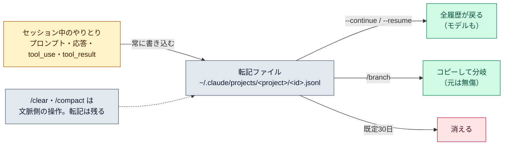

# セッションと再開（sessions）

::: tip 要点
1. セッション＝**プロジェクトのディレクトリに紐づいて保存された1つの会話**。書きながら常に保存されるので、終了しても `--continue` / `--resume` で戻れる
2. 再開で戻るのは**会話の全履歴（ツール呼び出しと結果を含む）とモデル**。戻らないのは起動時のフラグ（`--mcp-config` など）と、動いていたバックグラウンド処理。CLAUDE.md と設定ファイルは起動時に読み直される
3. `/branch` で**会話をそこまでコピーして分岐**できる。元は残る。同じセッションを2つの端末で開くと履歴が混ざる
:::

## 何が保存され、どこにあるか

会話は **JSONL の転記ファイル**として `~/.claude/projects/<project>/<セッションID>.jsonl` に、
書きながら常に保存される。`<project>` は作業ディレクトリのパスから作られるので、
同じリポジトリのセッションは同じ場所に並ぶ。既定では**30日**で消える（`cleanupPeriodDays`）。

`/clear` で[文脈](../internals/context-window.md)を空にしても、前の会話は転記に残っていて
`/resume` で戻れる。`/compact` も同じで、要約されるのは文脈のほうで転記は消えない。

## 再開で何が戻り、何が戻らないか

| 戻る | 戻らない |
|---|---|
| 会話の全履歴（ツール呼び出しと結果を含む） | 起動時のフラグ（`--mcp-config` `--settings` `--add-dir` など） |
| 使っていたモデル | セッション中に `/add-dir` で足したディレクトリ |
| 起動時に指定したエージェント | バックグラウンドの Bash と監視タスク |
| 権限モード（端末から直接再開したとき） | 前回終了時に実行中だったツール（続きは走らない） |

設定ファイルと [CLAUDE.md](./claude-md-memory.md) は起動時に読み直されるので、渡し直す必要はない。
再開の仕方によっては権限モードが戻らないので、`--permission-mode` で指定し直せる。

## 分岐と名前

- `/branch [名前]` は**そこまでの会話をコピーして切り替える**。元のセッションは無傷で一覧に残る。別の進め方を試すときに使う
- 同じセッションを分岐せずに2つの端末で開くと、両方のメッセージが1つの転記に混ざる
- `-n 名前` か `/rename 名前` で名前を付けると、`claude --resume 名前` で直接戻れる
- 長く放置した大きいセッションは、再開時に「要約から再開するか、そのまま読むか」を聞かれる。[キャッシュ](../internals/prompt-caching.md)が切れているので、どちらでも最初の1回は全履歴を処理し直す

## 自分で確かめる

- `claude --continue` — このディレクトリの直近の会話に戻る
- `claude --resume` — 一覧から選ぶ。`/resume` ならセッション中に切り替えられる
- `/export` — 会話を読める形で書き出す

セッションをまたいで持ち越す手段はこれで3つ揃う。**ルールは CLAUDE.md、学びは自動メモリ、会話そのものはセッションの再開。**

---

最終確認: **2026-09-13**

出典:

- [Manage sessions — Claude Code](https://code.claude.com/docs/en/sessions)（転記の場所と形式、再開で戻るもの・戻らないもの、`/branch`、名前、要約からの再開、`/clear` 後の `/resume`、既定30日の保存）
- [How the agent loop works — Agent SDK](https://code.claude.com/docs/en/agent-sdk/agent-loop)（「Sessions and continuity」節。再開で読んだファイルや実行した内容の文脈が戻ること、fork）
