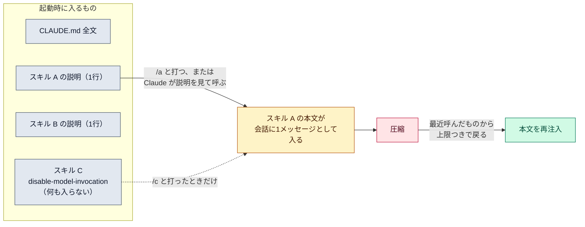

# スキル（skills）

::: tip 要点
1. スキル＝**必要なときだけ読まれる手順書**。`SKILL.md` 1枚で、起動時に入るのは1行の `description` だけ。本文は呼ばれたときに入る
2. 呼び方は2つ。自分が `/name` で呼ぶか、Claude が説明文を見て自分で呼ぶか。**副作用のある手順（deploy・commit）は `disable-model-invocation: true` で自分だけが呼べる**ようにする
3. 使い分け: **毎回守る事実 → CLAUDE.md、手順になったもの → スキル**。CLAUDE.md の一節が「手順」に育ったらスキルに切り出す
:::

## 何がいつ読まれるか

| もの | いつ入るか | 大きさ |
|---|---|---|
| [CLAUDE.md](./claude-md-memory.md) | 毎リクエスト | 全文 |
| ルール（`.claude/rules/`、`paths` 付き） | 該当するファイルを読んだとき | 全文 |
| スキルの説明 | 起動時 | 1行ずつ |
| **スキルの本文** | **呼ばれたとき** | 全文。会話に1メッセージとして入り、以後のターンでも残る |
| スキルの補助ファイル | 本文からリンクされて読まれたとき | 必要な分だけ |

呼ばれた本文は残り続けるので、**1行ごとに毎ターン費用がかかる**。短く書く。
[圧縮](../internals/context-window.md)のあとは、最近呼んだスキルから順に、上限つきで本文が戻る。
古いものは落ちる。

## 誰が呼ぶか

| 設定 | 自分が呼ぶ | Claude が呼ぶ | 説明が起動時に入る |
|---|---|---|---|
| 既定 | できる | できる | 入る |
| `disable-model-invocation: true` | できる | **できない** | 入らない |
| `user-invocable: false` | できない | できる | 入る |

deploy・commit・push のように**やり直しにくい手順は、自分だけが呼べる**設定にする。
説明も起動時に入らないので、呼ぶまでコンテキストを一切使わない。

## 使い分け

| 置き場 | 向いているもの |
|---|---|
| CLAUDE.md | 毎回守る事実。ビルドコマンド、規約、「必ず X する」 |
| スキル | 手順。チェックリスト、複数ステップの作業、呼ぶまで要らない参照資料 |

公式の判断基準は2つ。**同じ手順を何度もチャットに貼っている**、または
**CLAUDE.md の一節が「事実」でなく「手順」に育った**。どちらかならスキルに切り出す。

## 自分で確かめる

- 置き場: `~/.claude/skills/<name>/SKILL.md` は全プロジェクト、`.claude/skills/<name>/SKILL.md` はこのリポジトリだけ。同名なら個人用が勝つ
- `/` と打つと呼べるスキルの一覧が出る。引数は本文の `$ARGUMENTS` に入る
- このリポジトリの `.claude/skills/` には Spec Kit の手順（`/speckit-specify` など）が入っている。仕様を書く手順だから、CLAUDE.md でなくスキル

---

最終確認: **2026-09-13**

出典:

- [Extend Claude with skills — Claude Code](https://code.claude.com/docs/en/skills)（置き場と優先順、起動時は説明だけ、呼ばれた本文は残る、誰が呼ぶかの設定、CLAUDE.md との使い分け、圧縮後の再注入）
- [Explore the context window — Claude Code](https://code.claude.com/docs/en/context-window)（スキル説明の読み込みと、圧縮後に呼んだスキルだけが戻ること）
