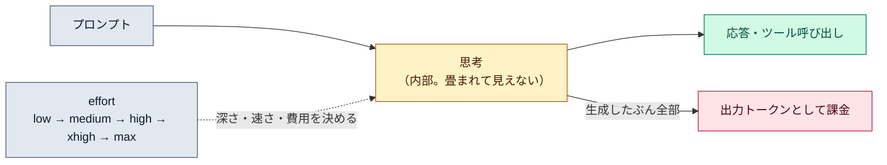

# 拡張思考と effort

::: tip 要点
1. 思考（thinking）＝**答えを出す前にモデルが内部で考える工程**。既定で有効。**画面では畳まれているが、生成された思考トークンはすべて課金される**
2. どれだけ考えるかは **effort** で決まる。`low → medium → high → xhigh → max` の順に深く、遅く、高くなる。既定は `high`。今のモデルは「考えるかどうか、どれだけ考えるか」を effort を目安に**自分で決める**（適応的推論）
3. 使い分けは作業の性質で。**短く範囲が決まった作業は low**、普段は `high`、難しい設計や長い自律作業は `xhigh`。`max` は考えすぎることがあるので試してから
:::

## 思考とは何か

モデルは応答の前に**内部で考える**。Claude Code はその出力を畳んで表示しないが（`Ctrl+O` で
灰色の斜体として見られる）、**思考トークンは出力トークンとして課金される**。表示の有無は
費用に関係ない。複雑な計画や推論では性能が大きく上がるため、既定で有効になっている。

今のモデルは**適応的推論**で動く。毎回決まった量を考えるのではなく、タスクの難しさを見て
「考えるかどうか、どれだけ考えるか」を自分で決める。その目安になるのが effort。

## effort の5段階

| レベル | 向くもの |
|---|---|
| `low` | 短く、範囲が決まっていて、賢さより速さが要る作業 |
| `medium` | 費用を抑えたい作業。賢さを少し譲る |
| `high` | **既定。** 費用と賢さのバランス |
| `xhigh` | 深い推論が要る作業。トークンは増える |
| `max` | 最も深い。ただし考えすぎることがあり、効果が頭打ちになりやすい。試してから |

モデルが対応しない段階を指定すると、その下で最も高い段階に落ちる。[サブエージェント](../internals/subagents.md)には
個別の effort を付けられるので、ファイル探しのような単純な子は `low` にすると安い。

## 費用との関係

思考は[コスト](../internals/costs.md)の中で見えにくい部分。長い自律作業で effort を上げると、
1ターンあたりの出力トークンが数万になることもある。逆に、賢さが要らない作業で `low` に
下げるだけで速く安くなる。プロンプトに `ultrathink` と書くと、設定を変えずにその1回だけ深く考える。

## 自分で確かめる

- `/effort` でスライダー、`/effort high` で直接指定。起動時は `--effort`、既定は設定の `effortLevel`
- `Ctrl+O` で思考の表示を切り替える。`Option+T`（macOS）で思考のオン／オフ（Fable モデルでは切れない）
- `/usage` の出力トークン数に思考ぶんが含まれる

---

最終確認: **2026-09-13**

出典:

- [Model configuration — Claude Code](https://code.claude.com/docs/en/model-config)（「Adjust effort level」節。5段階と用途、設定方法、思考の表示と課金、適応的推論、`ultrathink`）
- [Extended thinking — Claude API](https://platform.claude.com/docs/en/build-with-claude/extended-thinking)（思考の仕組み、適応的思考への移行、思考トークンの扱い）
