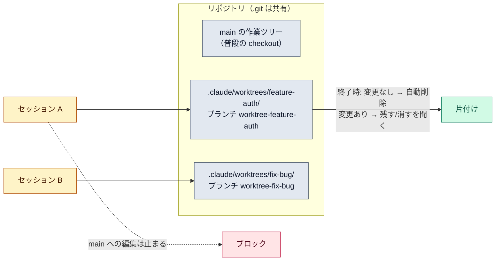

# ワークツリー（worktrees）

::: tip 要点
1. ワークツリー＝**同じリポジトリの別ブランチを、別ディレクトリに展開したもの**。セッションごとに1つ持てば、編集がぶつからずに並行で進められる
2. `claude --worktree <名前>` で `.claude/worktrees/<名前>/` に作られ、ブランチ `worktree-<名前>` に乗る。**中のセッションは main の作業ツリーを編集できない**（Claude Code が止める）
3. 終了時、変更が無ければ自動で片付く。**変更があれば「残す／消す」を聞かれる**。再開すると同じワークツリーに戻る
:::

## 何が起きているか

git のワークツリーは、**履歴と remote を共有したまま、ファイルとブランチだけ別にした作業ディレクトリ**。
Claude Code はこれをセッションの隔離に使う。セッション A が機能を作り、セッション B がバグを
直しても、ファイルは別なので互いの編集を踏まない。

`claude --worktree feature-auth` で始めると、`.claude/worktrees/feature-auth/` が作られ、
既定ではリポジトリの既定ブランチ（通常 `main`）から `worktree-feature-auth` が切られる。
名前を省くと Claude が付ける。セッション中に「ワークツリーで作業して」と頼むこともできる。

## 隔離はどう守られるか

ワークツリーの中のセッション（とその[サブエージェント](../internals/subagents.md)）に対して、
Claude Code は main の作業ツリーへの編集・そこを作業ディレクトリにするコマンド・git を main に
向ける操作を**ツールのエラーとして止める**。これはパーミッションとは別の検査で、切れない。

共有されるものもある。`.git` ディレクトリ、プロジェクト範囲のプラグイン、そして
「今後は聞かない」で保存した許可。許可は main 側の `settings.local.json` に書かれるので、
ワークツリーを消しても残る。

## 片付けと再開

- 終了時に**変更も新しいコミットも無ければ**、名前を付けていないセッションのワークツリーは自動で消える
- **変更があれば**「残す／消す」を聞かれる。消すとディレクトリもブランチも消える
- `--resume` で戻ると、セッションは同じワークツリーに入り直す。ディレクトリが消えていれば起動した場所で続く

## 自分で確かめる

- `git worktree list` で今あるワークツリーを見る
- `.claude/worktrees/` は `.gitignore` に入れておく（main 側で未追跡ファイルとして見えないように）
- `.env` のような gitignore 済みファイルを毎回持ち込むなら `.worktreeinclude` に書く

---

最終確認: **2026-09-13**

出典:

- [Run parallel sessions with worktrees — Claude Code](https://code.claude.com/docs/en/worktrees)（作り方、置き場とブランチ名、片付けの規則、再開、隔離の検査、共有されるもの、`.worktreeinclude`）
