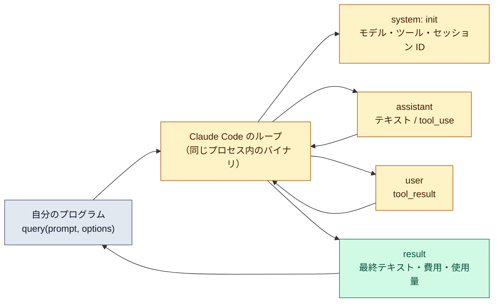

# Agent SDK でループを回す

::: tip 要点
1. Agent SDK＝**Claude Code のエージェントループをライブラリにしたもの**（Python / TypeScript）。`query(prompt, options)` を呼ぶと、組み込みツール・文脈管理・許可・フック・サブエージェント込みの**同じループが自分のプロセスの中で**回る
2. 結果は**メッセージの流れ**として返る。`system`（起動情報）→ `assistant`（応答とツール呼び出し）→ `user`（ツール結果）→ … → `result`（最終テキスト・費用・使用量・セッション ID）。`result` が来たらループは終わり
3. [`claude -p`](../guide/headless.md) は同じものを CLI から使う形。SDK は型付きのオブジェクトで受け取り、許可のコールバックや構造化出力を自分のコードで扱える。他の言語からは `-p --output-format json` を子プロセスで呼ぶ
:::

## 何が起きているか

[エージェントループ](../guide/agent-loop.md)のページで見た「評価 → ツール実行 → 結果を戻す」は、
Claude Code のターミナルの中で回っている。Agent SDK はそのループを**ライブラリとして切り出したもの**。
パッケージは Claude Code のバイナリを同梱していて、`query()` を呼ぶと自分のプロセスからそれを動かす。

だから SDK で動くものは Claude Code と同じ: Read / Edit / Bash などの組み込みツール、[圧縮](./compaction.md)、
[パーミッション](../guide/permission-modes.md)、[フック](./hooks.md)、[サブエージェント](./subagents.md)、
[MCP](./mcp.md)、[セッション](../guide/sessions.md)の再開。プロジェクトの `.claude/` や CLAUDE.md も読まれる。

## メッセージの流れ

`query()` は非同期の反復子で、ループが進むたびにメッセージを返す。

| 型 | いつ | 中身 |
|---|---|---|
| `system`（`init`） | 最初 | セッション ID、モデル、使えるツール、MCP の接続状態 |
| `assistant` | Claude が応答するたび | テキストか `tool_use`（内容ブロック1つにつき1メッセージ） |
| `user` | ツールが実行されるたび | `tool_result`。Claude に戻される内容 |
| `result` | ループの終わり | 最終テキスト、費用、使用量、セッション ID、成功か上限到達か |

進捗を出したいなら `assistant` を読む。結果だけ要るなら `result` を待つ。`result` の `subtype` が
`success` 以外なら、`max_turns` や予算の上限に当たったか、エラーで止まったということ。

## 何を自分で決めるか

- **ツールと許可**: `allowedTools` で事前に許可、`permissionMode` で基準線、`canUseTool` コールバックで1回ずつ判断
- **上限**: `maxTurns`（ツールを使うターン数）、`maxBudgetUsd`（費用）。放っておくと開いた課題では回り続ける
- **文脈**: `systemPrompt` の追記、`settingSources` で CLAUDE.md を読むかどうか、サブエージェントの定義
- **再開**: `result` のセッション ID を保存し、次の `query()` に `resume` で渡す

CLI で十分なことは CLI で。SDK が要るのは、応答をプログラムで処理する、許可をコードで判断する、
自分のアプリに組み込む、といった場合。

## 自分で確かめる

- `npm install @anthropic-ai/claude-agent-sdk` か `pip install claude-agent-sdk`。認証は API キー（claude.ai のログインは使えない）
- 最小の例は「`query({prompt})` を `for await` で回し、`result` を表示する」の数行
- 同じことを CLI でやるなら `claude -p "..." --output-format json`

---

最終確認: **2026-09-13**

出典:

- [Agent SDK overview — Agent SDK](https://code.claude.com/docs/en/agent-sdk/overview)（ライブラリとしての位置づけ、CLI / Client SDK / Managed Agents との比較、使える機能の一覧、認証の注意）
- [How the agent loop works — Agent SDK](https://code.claude.com/docs/en/agent-sdk/agent-loop)（メッセージの型、`result` の中身、上限の設定、再開）
