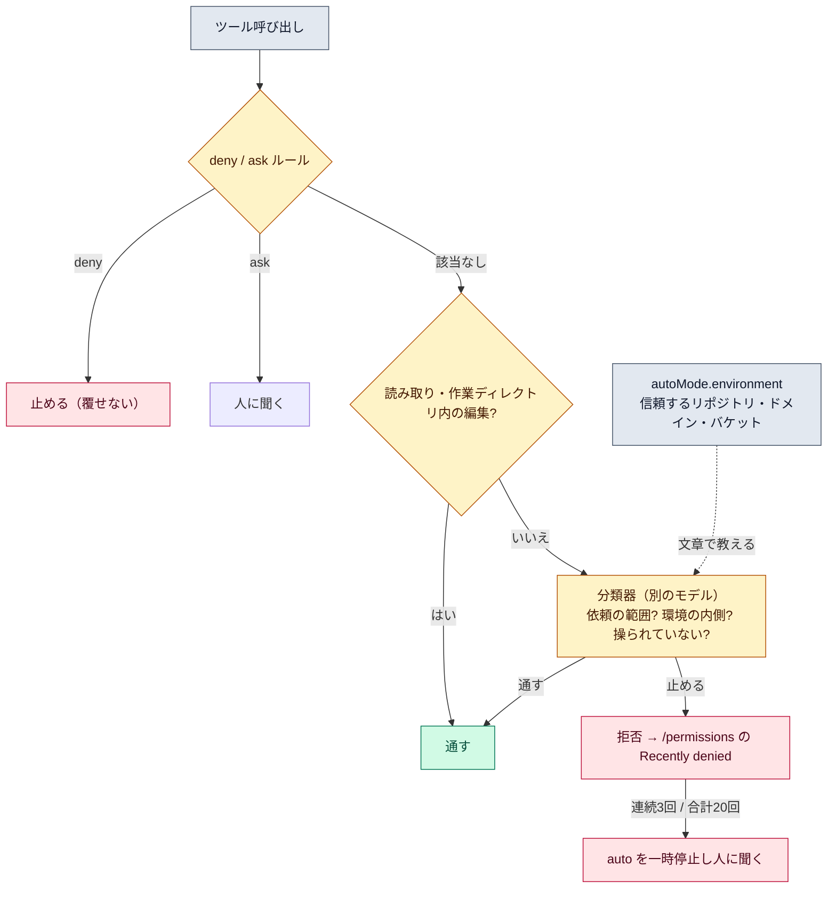

# auto モードの分類器

::: tip 要点
1. 分類器＝**auto モードで人の代わりに各操作を審査する別のモデル**。見るのは「依頼の範囲を超えていないか」「見慣れない場所に出ていないか」「読んだ内容に操られていないか」。取り返しのつかない操作、破壊的な操作、環境の外に向く操作を止める
2. 順番は **deny / ask ルール → 自動承認できるもの → 分類器**。deny は分類器より先で、誰も覆せない。読み取りと作業ディレクトリ内の編集は分類器を通らずに通る
3. 分類器は**自分の環境を知らない**。既定で信頼するのは作業リポジトリとその remote だけ。会社の GitHub org や S3 バケットへの操作は、`autoMode.environment` に**文章で**教えるまで止まる。連続3回か合計20回止めると auto を一時停止して人に聞く
:::



## 何を見ているか

分類器は、Claude が出したツール呼び出しを**本人の依頼と照らして**審査する。止めるのは大きく3種類。

- **依頼の範囲を超える操作。** 「リポジトリを片付けて」で force push はしない。「このブランチを force push して」と本人が具体的に言えば通る
- **環境の外に向く操作。** 知らないホスト、知らないバケット、公開の paste サービスへの送信。信頼していない場所への書き出しは持ち出しの疑いとして止める
- **読んだ内容に操られたように見える操作。** Issue の本文や Web ページの指示に従っているように見えるもの

分類器が読むのは、本人のメッセージ、Claude が実行するコマンド、CLAUDE.md。**以前のコマンドの出力は見ない**。
だから `rm -rf "$VAR"` のように、削除対象が出力からしか分からないコマンドは、パスを文字で書き直すまで止まる。

## 判定の順番

[パーミッション](../guide/permission-modes.md)のルールが**先**。deny に当たれば分類器に届く前に止まり、
ask に当たれば必ず人に聞く。「push の前に必ず聞いてほしい」なら、分類器の設定でなく
`permissions.ask` に `Bash(git push *)` を書く。会話で「レビューまで push しないで」と言うだけでは、
[圧縮](./compaction.md)でその発言が消えると境界も消える。

ルールに当たらないもののうち、**読み取りと作業ディレクトリ内の編集は分類器を通らず通る**。
残りが分類器へ行く。分類器の中では `hard_deny` → `soft_deny` → `allow` の例外 → 本人の明示した意図、の順。

## 環境を教える

既定で信頼するのは**作業ディレクトリのリポジトリと、その設定済み remote だけ**。それ以外は「外」。
会社の GitHub org、社内ドメイン、ビルド用バケットへの操作を通したいなら、`~/.claude/settings.json` の
`autoMode.environment` に**文章で**書く。

```json
{ "autoMode": { "environment": [
  "$defaults",
  "Source control: github.example.com/acme-corp and all repos under it",
  "Trusted cloud buckets: s3://acme-build-artifacts"
] } }
```

正規表現やツールのパターンではなく、新しい同僚に自分のインフラを説明する文で書く。`"$defaults"` を
入れないと既定の項目が全部置き換わる。プロジェクトの `.claude/settings.json` からは**読まれない**
（リポジトリが自分に許可を足せてしまうため）。`/auto-mode-setup` で下書きを作らせることもできる。

## 止まったとき

- 通知が出て、`/permissions` の **Recently denied** に記録される。`r` で「人が承認して再実行」
- **連続3回か合計20回**止めると auto を一時停止し、通常の確認に戻る。承認すれば auto が再開する
- 同じ宛先で繰り返し止まるなら、分類器が環境を知らないということ。`environment` に足す
- 分類器は安全を**保証しない**。方向を信頼できる作業で使い、機微な操作は人が見る

---

最終確認: **2026-09-13**

出典:

- [Configure auto mode — Claude Code](https://code.claude.com/docs/en/auto-mode-config)（既定の信頼範囲、deny / ask が先であること、`autoMode.environment` の書き方と読まれる範囲、4段の優先順、Recently denied、繰り返し止まったときの対処）
- [Choose a permission mode — Claude Code](https://code.claude.com/docs/en/permission-modes)（分類器が見るもの・見ないもの、判定の順番、一時停止のしきい値、安全を保証しない旨）
