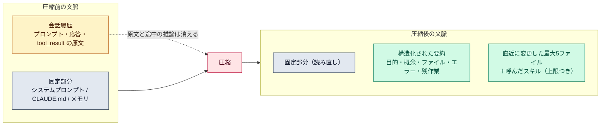

# 圧縮の中身（compaction）

::: tip 要点
1. 圧縮＝**会話履歴を1つの構造化された要約に置き換える**こと。残るのは目的・重要な概念・触ったファイル・エラーと直し方・残作業・今の作業。**ツール出力の原文と途中の推論は消える**
2. 要約のほかに**ディスクから読み直されるもの**がある。システムプロンプト、プロジェクト直下の CLAUDE.md、自動メモリ、プランモードの計画、直近に変更した最大5ファイルとそれに効くルール、呼んだスキルの本文（上限つき）。**スキルの一覧は戻らない**
3. 自動で走るのは上限に近づいたとき。**先に手で走らせて何を残すか指示できる**（`/compact 指示`、CLAUDE.md の要約指示、`/rewind` の部分要約）
:::

## 要約に何が残り、何が消えるか

圧縮は会話履歴を**1つの要約**に置き換える。要約が残すのは、依頼と意図、重要な技術的概念、
調べた・変えたファイル（重要なコード片つき）、エラーとその直し方、残っている作業、今やっている作業。
**消えるのは原文**。ツール出力の全文（読んだファイルの中身、コマンドの出力）と途中の推論は無くなる。
Claude は「そういう作業をした」ことは参照できるが、正確な内容は持っていない。

## 読み直されるもの

| もの | 圧縮後 |
|---|---|
| システムプロンプト | そのまま効く |
| プロジェクト直下の CLAUDE.md、パス指定の無いルール | ディスクから読み直し |
| 自動メモリ | ディスクから読み直し |
| プランモードで書いた計画 | ディスクから読み直し |
| 直近に読んだ・変えたファイル | **最大5つ**、新しいものから読み直し。それに効くルールと下層の CLAUDE.md も |
| 呼んだスキルの本文 | 読み直し。ただし1スキルと合計に上限があり、古いものから落ちる |
| スキルの一覧（説明1行ずつ） | **戻らない**。呼んだものだけ |
| フックが以前足した文脈 | 会話と一緒に要約される |

だから「ずっと守るルール」は[CLAUDE.md](../guide/claude-md-memory.md)、長い手順は[スキル](../guide/skills.md)の**先頭**に書く。
スキルの本文は先頭から残るので、大事な指示ほど上に置く。

## 自動と手動

自動圧縮は上限に近づいたときに走り、手動の `/compact` と同じ手順。しきい値はモデルと設定で変わる。
先に動くほうが、何を残すかを決められる。

- `/compact 認証バグの修正に集中して` のように**指示を添えて**走らせる。自動の推測より狙って残せる
- CLAUDE.md に「要約するときは必ず残すもの」の節を書いておくと、自動圧縮でもそれが使われる
- `/rewind` で1点を選び「ここから要約」「ここまで要約」。会話の一部だけ畳む
- `/autocompact` で、どれだけ埋まったら自動で走るかを変える
- 無関係な作業に移るなら `/clear`。要約すら要らない

## 自分で確かめる

- `/context` で今どれだけ埋まっているか。圧縮後に何が戻ったかもここで分かる
- 圧縮の直前には PreCompact [フック](./hooks.md)が走る。全文を残したければここで転記を退避する
- 圧縮しても[転記ファイル](../guide/sessions.md)は消えない。消えるのは文脈のほう

---

最終確認: **2026-09-13**

出典:

- [Explore the context window — Claude Code](https://code.claude.com/docs/en/context-window)（「What survives compaction」の表、要約が残すもの・消えるもの、`/compact` の指示、`/rewind` の部分要約、`/autocompact`）
- [How the agent loop works — Agent SDK](https://code.claude.com/docs/en/agent-sdk/agent-loop)（「Automatic compaction」節。CLAUDE.md の要約指示、PreCompact フック）
