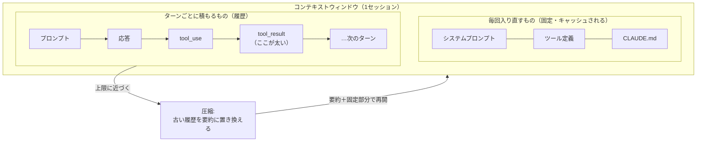

# コンテキストウィンドウ（context window）

> **要点**
> 1. コンテキストウィンドウ＝**そのセッションでモデルに見えている情報の全部**。システムプロンプト・ツール定義・CLAUDE.md・会話履歴・ツール出力が入る
> 2. **ターン間でリセットされない。** いちばん太るのは大きなツール出力（ファイル読み・コマンド出力）
> 3. 上限に近づくと**圧縮（compaction）**。古い履歴は要約に置き換わる。CLAUDE.md は毎回入り直すが、最初のプロンプトで言った細かい指示は消えうる

## 何が入っているか

モデルは毎ターン、次の全部を受け取る（[エージェントループ](../guide/agent-loop.md)の「受け取る」段階）。

| 入るもの | いつ | 大きさの性質 |
|---|---|---|
| システムプロンプト | 毎リクエスト | 小さく固定 |
| CLAUDE.md | 毎リクエスト | 全文が毎回入る（ただしキャッシュされる） |
| ツール定義 | 毎リクエスト | 組み込みツールは毎回。MCP のスキーマは既定で遅延読み込み |
| 会話履歴 | ターンごとに増える | プロンプト・応答・ツールの入力と出力 |
| スキルの説明 | セッション開始時 | 1行ずつ。本文は呼んだときだけ |

固定部分（システムプロンプト・ツール定義・CLAUDE.md）は毎回同じなので
[プロンプトキャッシュ](https://platform.claude.com/docs/en/build-with-claude/prompt-caching)が効き、2回目以降は安くなる。

## ターンをまたいで消えない

コンテキストは**セッションの中でリセットされない。** 1周ごとにプロンプト・応答・ツール出力が
履歴に足されていく。大きなファイルを1つ読む、出力の多いコマンドを1回走らせる、
それだけで数千トークンが1ターンで積まれる。だから**ツール呼び出しの多い長いセッションほど重い**。

## 圧縮で何が起きる

上限に近づくと、ハーネスが**古い履歴を要約に置き換えて**空きを作る（自動圧縮）。
直近のやりとりと重要な決定は残すが、**要約は原文ではない**。

| 残る | 消えうる |
|---|---|
| システムプロンプト・CLAUDE.md（毎回入り直す） | ツール出力の原文（ファイル内容・コマンド出力） |
| 会話全体の要約（目的・触ったファイル・エラーと直し方・残タスク） | 最初のプロンプトに書いた細かい指示 |
| 直近に変更したファイル（読み直される）・呼んだスキルの本文 | 途中の推論の詳細 |

**だから「ずっと守ってほしいルール」は最初のプロンプトではなく CLAUDE.md に書く。**
長いセッションで急に前の指示を忘れるのは、圧縮でその指示が要約に埋もれたときに起きる。

## 自分で確かめる

- `/context` — 今のコンテキストの内訳を色つきの表で見る
- `/compact [指示]` — 手動で圧縮する。指示を添えると、要約で残す点を指定できる

---

最終確認: **2026-09-13**

出典:

- [How the agent loop works — Agent SDK](https://code.claude.com/docs/en/agent-sdk/agent-loop)（「The context window」「What consumes context」「Automatic compaction」節）
- [Explore the context window — Claude Code](https://code.claude.com/docs/en/context-window)（圧縮で何が残り、何が消えるか）
- [Commands reference — Claude Code](https://code.claude.com/docs/en/commands)（`/context` `/compact` の説明）
