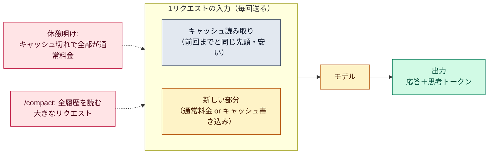

# コストの内訳

::: tip 要点
1. 費用は**トークン数**で決まる。1リクエストの入力は「会話の全履歴」なので、**セッションが長いほど1回あたりが重い**。1行の質問でも、履歴全部を送っている
2. その大半は[キャッシュ](./prompt-caching.md)の**読み取り**（安い）で済んでいる。高くつくのは、キャッシュが切れた直後の1回（休憩明け）、圧縮そのもの（大きな要約リクエスト）、そして[思考](../guide/thinking-effort.md)の出力トークン
3. 減らす手は、文脈を小さく保つこと。**無関係な作業では `/clear`**、長い作業の前に `/compact 指示`、大きな読み込みは[サブエージェント](./subagents.md)へ、単純な作業は effort を下げる
:::

## 1リクエストの費用はどう決まるか

Claude Code は**毎リクエスト、会話の全履歴を入力として送る**。ツールを使うたびに、その結果を
足してまた送る。だから[コンテキスト](./context-window.md)が大きいほど、1回の費用が上がる。
セッションを開いて数時間経ったあとの1行の質問でも、履歴全部ぶんの使用量がかかる。

ただし先頭が前回と同じ部分は**キャッシュ読み取り**の料金で済む（通常のおよそ1/10）。
長いセッションが成り立つのはこのため。`/usage` の「Prompt cache」行に、入力のうち何割が
キャッシュから来たかが出る。

## 高くつく場面

| 場面 | 何が起きるか |
|---|---|
| **休憩明けの最初のメッセージ** | キャッシュの寿命が切れ、全文脈を通常料金で処理し直す。長い大きなセッションの再開時は「要約から再開」を勧められる |
| **圧縮** | `/compact` は要約するために全履歴を読む。大きな文脈の圧縮はそれ自体が大きなリクエスト |
| **思考** | 思考トークンは出力として課金される。effort が高いと1ターンで数万になることもある |
| **待機中の自動実行** | 定期タスクや他セッションからのメッセージは、放置中でも全文脈を送って1ターン使う |
| **サブエージェントの数** | 各サブエージェントが自分の文脈で API を呼ぶ。合計に入る |

## 減らす手

- **無関係な作業に移るなら `/clear`。** 古い文脈は以後の毎メッセージに乗る。`/rename` してから消せば `/resume` で戻れる
- **長い作業の前に `/compact 指示`。** 自動圧縮を待つより、何を残すかを決めて先に畳む
- **大きな読み込みは[サブエージェント](./subagents.md)に。** 出力は子の文脈に溜まり、親には要約だけ
- **単純な作業は effort を下げる。** [フック](./hooks.md)でテスト出力を失敗行だけに絞る手もある
- **CLAUDE.md を短く。** 毎回入るので、手順は[スキル](../guide/skills.md)へ
- **MCP サーバーを減らす。** 使っていないものは `/mcp` で無効に。CLI が使える操作は CLI のほうが軽い

## 自分で確かめる

- `/usage` — このセッションのトークン数・見積もり額、キャッシュの効き具合、プランの残り。`/cost` はその別名
- `/context` — 今の文脈の内訳。何が場所を取っているか
- 状態バーに文脈の使用量を出す設定もある

---

最終確認: **2026-09-13**

出典:

- [Manage costs effectively — Claude Code](https://code.claude.com/docs/en/costs)（「Why usage climbs in a long session」節、`/usage` の中身とキャッシュ統計、減らす方法の一覧、思考トークンの課金、バックグラウンドの消費）
- [Prompt caching — Claude API](https://platform.claude.com/docs/en/build-with-claude/prompt-caching)（読み取りの料金倍率と寿命）
