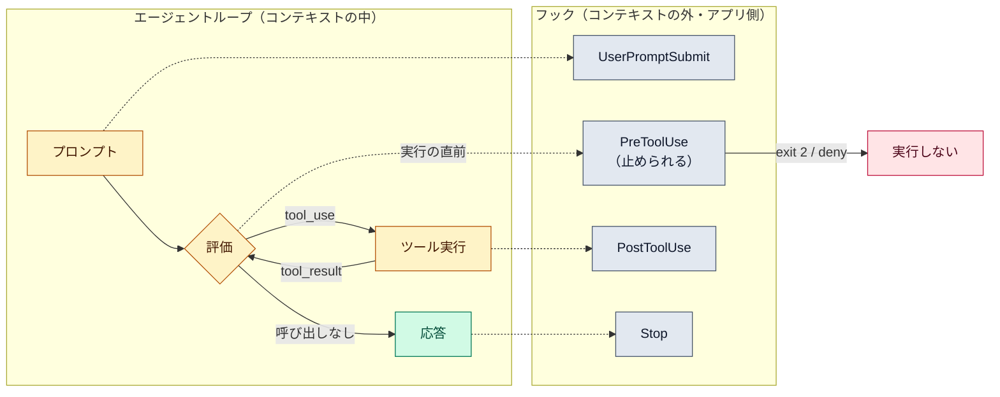

# フック（hooks）

::: tip 要点
1. フック＝**ループの決まった時点で、Claude Code が自動で走らせる自分のコマンド**。動かすのはモデルではなくアプリ側で、**モデルの判断に関係なく必ず走る**
2. 走る場所は**コンテキストの外**。だから文脈を消費しない。結果は終了コードと stdout の JSON で Claude Code に返り、必要なものだけがモデルに届く
3. 止められる時点は限られる。**PreToolUse で終了コード 2 か deny を返すとツール呼び出しは実行されない**。すでに起きたこと（PostToolUse）は止められない
:::

## いつ走るか

| イベント | 何が起きたとき | 止められる / 止められない |
|---|---|---|
| SessionStart | セッションの開始・再開 | 止められない |
| UserPromptSubmit | プロンプトを送った直後、モデルが読む前 | 止められる |
| PreToolUse | ツール呼び出しの**直前** | 止められる |
| PostToolUse | ツール呼び出しが成功した後 | 止められない（もう起きた） |
| Stop | モデルが応答を終えたとき | 止められる（続けさせる） |
| PreCompact | 圧縮の直前 | 止められない（記録に使う） |

`matcher` でツール名を絞れる（例: `Bash`、`Edit|Write`）。同じイベントのフックは並列に走る。

## 何を受け取り、何を返すか

フックは stdin で JSON を受け取る。イベント名、ツール名、ツールの引数、作業ディレクトリなど。
返し方は終了コードで決まる。

| 終了コード | 意味 | モデルに届くもの |
|---|---|---|
| 0 | 通す | stdout が JSON なら、その中の `additionalContext` や `permissionDecision`（allow / deny / ask）を使う |
| 2 | **止める** | stderr の文章が「なぜ止めたか」として渡る |
| その他 | 通す（警告） | 何も届かない。画面にフックのエラーが出るだけ |

つまりフックは「黙って通す」「理由つきで止める」「文脈に一言足す」の3つができる。

## なぜ CLAUDE.md より確実か

[CLAUDE.md](../guide/claude-md-memory.md) は**モデルが読む文脈**で、守るかどうかはモデル次第。
[圧縮](./context-window.md)で埋もれることもある。フックは**アプリが実行する処理**で、
モデルが忘れても、圧縮されても、決まった時点で必ず走る。しかも文脈を消費しない。

ただし[パーミッションのルール](../guide/permission-modes.md)はフックより先に評価される。
deny ルールに当たるものは、フックが allow と返しても止まる。

## 自分で確かめる

- 置き場は `settings.json` の `hooks`（`~/.claude/` なら全プロジェクト、`.claude/` ならこのプロジェクト）
- 型は `command`（シェル）のほかに `prompt`（モデルに1回判定させる）や `http` もある
- このリポジトリの `.githooks/`（pre-commit で秘密情報を止める、pre-push で main を守る）は git 側の同じ発想

---

最終確認: **2026-09-13**

出典:

- [Hooks reference — Claude Code](https://code.claude.com/docs/en/hooks)（イベント一覧、stdin の JSON、終了コードの意味、stdout の JSON の項目、matcher、並列実行）
- [Get started with hooks — Claude Code](https://code.claude.com/docs/en/hooks-guide)（置き場と使いどころ）
- [How the agent loop works — Agent SDK](https://code.claude.com/docs/en/agent-sdk/agent-loop)（「Hooks」節。アプリのプロセスで走り、文脈を消費しない）
