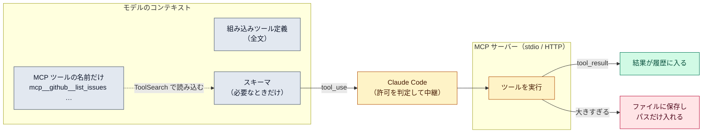

# MCP（Model Context Protocol）

::: tip 要点
1. MCP＝**外部のツールやデータを「ツール定義」としてループに差し込む共通規格**。サーバーを1つ繋ぐと、そのツール群が `mcp__サーバー名__ツール名` という名前でモデルに見える
2. 起動時に入るのは**ツールの名前だけ**。引数の型（スキーマ）は既定で後回しにされ、使うときに `ToolSearch` で読み込む。だから何十個繋いでも文脈は太りにくい
3. MCP のツールも[エージェントループ](../guide/agent-loop.md)の tool_use → 実行 → tool_result と同じ道を通る。**実行するのは Claude Code とサーバーで、モデルではない。** 出力が大きすぎればファイルに逃がされる
:::

## 何が起きているか

MCP サーバーは、データベース・Issue トラッカー・ブラウザなどを**ツールの形**で差し出す。
Claude Code はそれを組み込みツールと同じ列に並べ、モデルには `mcp__<サーバー名>__<ツール名>`
という名前で見せる。モデルにとっては「ツールが増えた」だけで、呼び方は変わらない。

繋ぎ方は2つ。**stdio** は手元でプロセスを起動して標準入出力で話す。**HTTP** はリモートの
URL に繋ぐ。SSE は非推奨になっている（2026-09-13 時点）。

## 文脈をどう守っているか

| もの | 起動時に入るか | どう扱われるか |
|---|---|---|
| 組み込みツールの定義 | 入る（全文） | 毎リクエスト同じなので[キャッシュ](./prompt-caching.md)が効く |
| MCP ツールのスキーマ | **名前だけ** | 使うときに `ToolSearch` で必要なものだけ読み込む |
| MCP ツールの出力 | — | 上限を超えるとファイルに保存され、会話にはパスだけ入る |

ツール探索が効かない構成（古いモデル、明示的に無効化した場合）では**全サーバーの全スキーマが
毎回入る**。サーバーを数個繋いだだけで、作業を始める前に[コンテキスト](./context-window.md)が
かなり埋まる理由がこれ。

## 許可と信頼

- MCP ツールも[パーミッション](../guide/permission-modes.md)の対象。`acceptEdits` では自動承認されない。ルールは `mcp__github__*` のようにサーバー単位で書ける
- サーバーは外部の内容（Issue の本文、Web ページ）を読み込んで返す。その内容が「指示」に見えると、モデルが従ってしまうことがある（プロンプトインジェクション）。**信頼できるサーバーだけ繋ぐ**
- プロジェクトの `.mcp.json` は git で共有されるため、初回に「このサーバーを使うか」の承認を求められる

## 自分で確かめる

- `claude mcp add` で追加、`claude mcp list` で接続状態
- 置き場は3段階。ローカル（自分だけ・このプロジェクト）／プロジェクト（`.mcp.json`、git で共有）／ユーザー（自分の全プロジェクト）
- `/context` を見ると、MCP ツールが文脈をどれだけ使っているかが出る

---

最終確認: **2026-09-13**

出典:

- [Connect Claude Code to tools via MCP — Claude Code](https://code.claude.com/docs/en/mcp)（繋ぎ方、置き場の3段階、ツール名の形、出力の上限とファイル退避、信頼の注意、`.mcp.json` の承認）
- [Connect to external tools with MCP — Agent SDK](https://code.claude.com/docs/en/agent-sdk/mcp)（`mcp__<server>__<tool>`、ツール探索、`acceptEdits` では自動承認されないこと）
- [Explore the context window — Claude Code](https://code.claude.com/docs/en/context-window)（起動時は名前だけ入り、スキーマは遅延読み込みされること）
