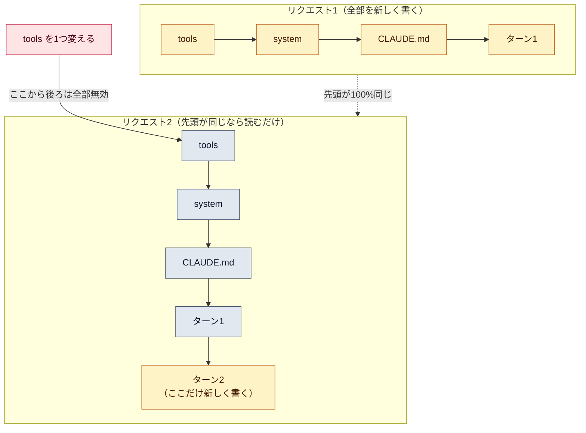

# プロンプトキャッシュ（prompt caching）

::: tip 要点
1. キャッシュ＝**先頭が前回と完全に同じ部分**は計算し直さず再利用する。順序は tools → system → messages で、この順に「先頭」が決まる
2. 先頭のどこかが変わると、**そこから後ろは全部無効**。だから変わらないもの（システムプロンプト・ツール定義・CLAUDE.md）を前に、変わるものを後ろに置く
3. 寿命は5分で、**使うたびに無料で延びる**。会話が進むとキャッシュの位置も前へ進み、前のターンまでが「読み取り」になる。Claude Code はこれを自動でやっている
:::

## 何がキャッシュされるか

モデルに送るプロンプトは **tools → system → messages** の順に並ぶ。キャッシュは
この並びの**先頭から、ある位置まで**を丸ごと覚える。次のリクエストで先頭がそこまで
**100% 同じ**（文字も画像も）なら、その部分の計算を飛ばして続きだけ処理する。

[コンテキストウィンドウ](./context-window.md)で「固定部分はキャッシュされる」と書いたのは
このこと。システムプロンプト・ツール定義・CLAUDE.md は毎回同じ先頭になる。

## 何が壊すか

先頭のどこかが変わると、**そこから後ろは全部**作り直しになる。

| 変えた場所 | 無効になる範囲 |
|---|---|
| ツール定義（tools） | **全部**（system も履歴も） |
| システムプロンプト（system） | system と、それより後ろの履歴 |
| 途中のメッセージ・画像 | そのメッセージより後ろ |

だから**時刻や毎回変わる ID を先頭近くに入れると、毎回キャッシュが外れる**。変わるものは
いちばん後ろに置く。ツールの一覧が実行のたびに増えたり減ったりするのも同じ理由で危ない。

## 寿命と料金の向き

- 寿命は**5分**。キャッシュが読まれるたびに**追加料金なしで延びる**（1時間の選択肢もある）
- 会話が進むと、前のターンまでが「読み取り」になり、新しいターンだけが「書き込み」になる。
  キャッシュの位置は自動で前へ進む
- 書き込みは通常の入力より少し高く、読み取りはおよそ **1/10**（2026-09-13 時点。モデルによって例外あり）

つまり長いセッションは「毎回全部を送っているのに、大半は安い読み取り」で回っている。

## Claude Code ではどうなっているか

Claude Code では設定なしで自動的に効く。固定部分（システムプロンプト・ツール定義・CLAUDE.md）は
毎リクエスト同じなので先頭が揃い、ターンを重ねるほど読み取りの割合が増える。

API を直接叩くときは、応答の `usage` に `cache_read_input_tokens`（読めた分）と
`cache_creation_input_tokens`（新しく書いた分）が出る。読み取りが毎回 0 なら、先頭のどこかに
毎回変わるものが混ざっている。

---

最終確認: **2026-09-13**

出典:

- [Prompt caching — Claude API](https://platform.claude.com/docs/en/build-with-claude/prompt-caching)（先頭一致の仕組み、tools → system → messages の階層、無効化の規則、寿命、料金の倍率、`usage` の項目）
- [How the agent loop works — Agent SDK](https://code.claude.com/docs/en/agent-sdk/agent-loop)（「The context window」節。固定部分が自動でキャッシュされること）
