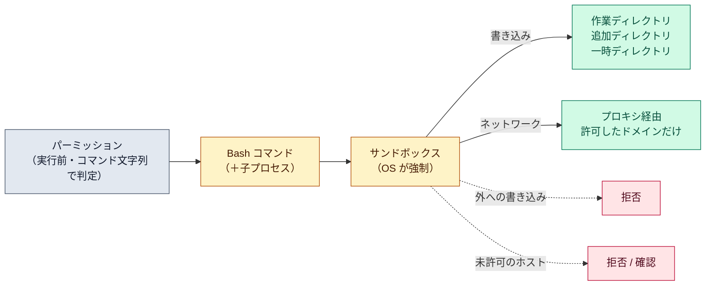

# サンドボックス（sandboxed Bash）

::: tip 要点
1. サンドボックス＝**Bash コマンドを OS の隔離の中で走らせる**仕組み。書き込みは作業ディレクトリ・追加したディレクトリ・一時ディレクトリだけ、ネットワークは許可したドメインだけ。子プロセスにも効く
2. [パーミッション](../guide/permission-modes.md)とは**別の層**。パーミッションは実行前にコマンド文字列で「通すか」を決め、サンドボックスは実行中のプロセスを OS が縛る。だから「通したあとに何が起きても届かない」を作れる
3. 隔離があるので、**サンドボックス内のコマンドは聞かずに走らせられる**（auto-allow）。deny ルールはそれでも効く。守らないものもある: 既定では読み取りはほぼ全域で、認証情報も読める
:::

## 何を隔離するか

対象は **Bash コマンドとその子プロセスだけ**。Read や Edit、MCP には効かない（それらはパーミッションの担当）。
隔離は2層ある。

| 層 | 既定 | 変えるには |
|---|---|---|
| ファイル | 書き込みは作業ディレクトリ・追加ディレクトリ・セッションの一時ディレクトリだけ。読み取りはほぼ全域 | `sandbox.filesystem` の allowWrite / denyRead など |
| ネットワーク | 外のプロキシを通し、許可していないホストは初回に確認（auto モードでは分類器が判定） | `allowedDomains`、`WebFetch(domain:...)` ルール |

書き込める範囲の中でも、`.claude` の設定・スキル・フック、`.mcp.json`、シェルの起動ファイル、
`~/.claude` の中身などは**守られる**。コマンドがそこを書き換えられると、自分に権限を足したり
サンドボックスの外で走るフックを仕込めてしまうから。

OS の仕組みで強制する。macOS は Seatbelt、Linux と WSL2 は bubblewrap。Windows ネイティブは非対応。

## パーミッションとどう違うか

| | パーミッション | サンドボックス |
|---|---|---|
| いつ | 実行**前** | 実行**中** |
| 何を見るか | コマンド文字列（auto では分類器の判断） | 実際のファイルアクセスと通信 |
| 誰が強制 | Claude Code | OS |
| 対象 | すべてのツール | Bash とその子プロセス |

2つは補い合う。パーミッションだけだと「通した後に何をするか」は文字列から推測するしかない。
サンドボックスがあれば、通した後でも境界の外には届かない。だから **auto-allow モード**では、
サンドボックス内のコマンドを聞かずに走らせられる。deny ルールはそれでも効く。

## 守らないもの

- **読み取り。** 既定では `~/.ssh` や `~/.aws/credentials` も読める。`sandbox.credentials` で塞ぐ
- **サンドボックスの外で走るもの。** [フック](./hooks.md)や MCP サーバーは対象外
- **逃げ道。** 中で動かないコマンドは、既定では確認のうえサンドボックス無しで再実行できる。
  `allowUnsandboxedCommands: false` で塞げる

## 自分で確かめる

- `/sandbox` でパネルを開く。モード（auto-allow か通常の確認か）と、足りない依存が出る
- 設定ファイルなら `"sandbox": {"enabled": true}`。組織で強制するなら管理設定に
- ブロックされたコマンドの結果には、拒否されたパスやホストが書かれる。Claude はそれを見て直す

---

最終確認: **2026-09-13**

出典:

- [Configure the sandboxed Bash tool — Claude Code](https://code.claude.com/docs/en/sandboxing)（隔離の2層、守られるパス、OS の仕組み、パーミッションとの関係、auto-allow、逃げ道、限界）
