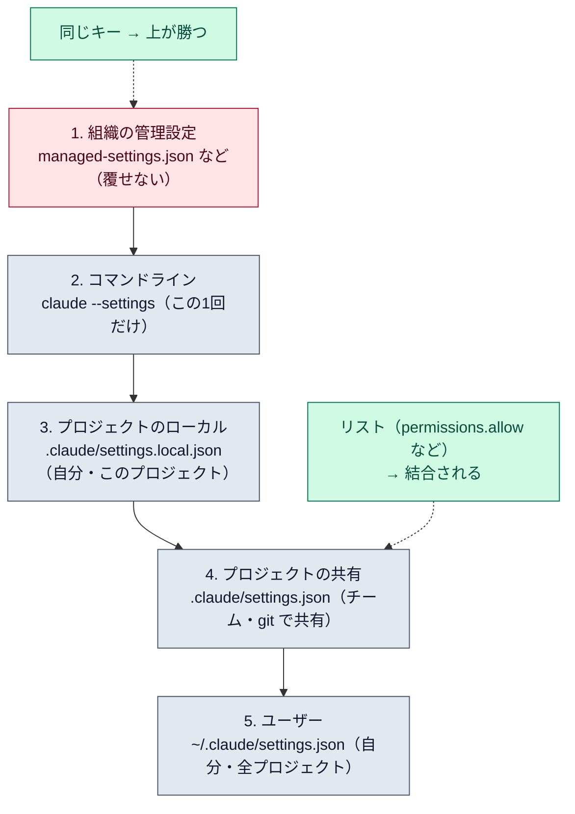

# 設定の階層

::: tip 要点
1. 設定は**5段に重なり、上が勝つ**。上から、組織の管理設定 → コマンドライン（`--settings`）→ プロジェクトのローカル（`.claude/settings.local.json`）→ プロジェクトの共有（`.claude/settings.json`）→ ユーザー（`~/.claude/settings.json`）
2. **管理設定は覆せない。** `--settings` で渡しても負ける。逆に、自分の値をプロジェクトの共有設定に負けたくないなら、ローカル設定に書く
3. 例外は**リスト**。`permissions.allow` のようなキーは上書きでなく**結合**される。各ファイルが足せるが、他のファイルの分は消せない
:::

## 5つの置き場と誰に効くか

| 段 | ファイル | 誰に効くか | 何を書くか |
|---|---|---|---|
| 1 | 管理設定（`managed-settings.json`、MDM、サーバー管理） | 組織が配った全員 | セキュリティの方針。禁止するツールなど |
| 2 | `claude --settings <file または JSON>` | 自分・この1セッション | 試したい値。ファイルには残らない |
| 3 | `.claude/settings.local.json` | 自分・このプロジェクト | 個人の上書き。git には入れない |
| 4 | `.claude/settings.json` | プロジェクトの全員 | チーム共通の許可・フック・プラグイン |
| 5 | `~/.claude/settings.json` | 自分・全プロジェクト | 個人の既定 |

チームで揃えたいものは 4 に書いてコミットする。自分だけ変えたいものは 3 に書く。3 は 4 より上なので、
チームの値を自分の環境だけで上書きできる。

## 同じキーがあったら

**上の段が勝つ。** ユーザー設定で `false`、プロジェクト共有で `true` なら、そのプロジェクトでは
`true`。取り戻したければローカル設定に `false` を書く。管理設定が `true` なら、どこに何を書いても
`true` のまま。`/status` でどの管理設定が効いているか見られる。

例外が2つある。

- **リストは結合。** `permissions.allow` や `deny` は各ファイルの分が足し合わされる。あるファイルの
  エントリを別のファイルから消すことはできない
- **環境変数は段ではない。** キーごとに「環境変数とフラグのどちらが勝つか」が決まっている。
  たとえば `--model` は設定の `model` にもモデルの環境変数にも勝つ

## 何がどこに書かれるか

[パーミッション](../guide/permission-modes.md)の「今後は聞かない」は 3（ローカル）に保存される。
[フック](./hooks.md)と [MCP](./mcp.md) の `.mcp.json` はプロジェクトで共有され、
`-p` では確認なしに走るので、信頼していないリポジトリでは注意が要る。
[CLAUDE.md](../guide/claude-md-memory.md) は設定ではなく「読む文脈」で、この階層とは別の仕組み。

## 自分で確かめる

- `/config` で対話的に変える。どのファイルに書かれたかは画面に出る
- `/status` で効いている設定の出どころ。`/permissions` でルールごとの出どころ
- 壊れた JSON は起動時に指摘される。`claude doctor` でも確認できる

---

最終確認: **2026-09-13**

出典:

- [Settings files and precedence — Claude Code](https://code.claude.com/docs/en/settings)（5段の並びと優先順、管理設定は覆せない、リストは結合、環境変数の扱い、例）
