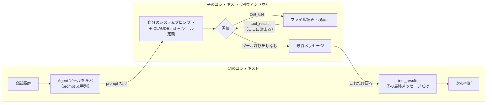

# サブエージェント（subagent）

> **要点**
> 1. サブエージェント＝**別のコンテキストウィンドウで回る、もう1つのエージェントループ**。親の会話履歴・親が読んだファイル・親のシステムプロンプトは見えない
> 2. 親から渡るのは **Agent ツールの prompt 文字列だけ**。子は自分のシステムプロンプト＋CLAUDE.md＋ツール定義で新しく始まる
> 3. 親に戻るのは **子の最終メッセージだけ**（tool_result として）。子が途中で読んだものは親に積まれない。だから親が軽いまま

## 何が渡り、何が渡らないか

子のコンテキストは**空ではないが、親の続きでもない**。

| 子が受け取る | 子が受け取らない |
|---|---|
| 自分のシステムプロンプト＋ Agent ツールの prompt | 親の会話履歴・親のツール結果 |
| プロジェクトの CLAUDE.md（Explore / Plan は読まない） | 親のシステムプロンプト |
| ツール定義（親と同じか、絞った一部） | 親の自動メモリ・出力スタイル |
| 作業ディレクトリなどの環境情報 | 親がすでに呼んだスキルの本文 |

だから子に必要なファイルパス・エラー文・決定事項は、**prompt 文字列に書いて渡す**しかない。

## 戻るのは要約だけ

子は自分の箱の中で[エージェントループ](../guide/agent-loop.md)を回す。ファイルを何十個読んでも、
その tool_result は**子の箱に溜まる**。親に返るのは子の最終メッセージ1つで、Agent ツールの
tool_result として親の履歴に足される。

これが[コンテキストウィンドウ](./context-window.md)を軽く保つ仕組みそのもの。探索や調査を
子に任せると、親の履歴は「子の要約ぶん」しか増えない。

## 例外と限界

- **fork** は例外で、**親の会話全体を引き継いで**始まる。それでも子のツール呼び出しは親に積まれず、戻るのは最終結果だけ
- 子は子を呼べる（既定で親から3層まで）。親に戻るのは**直下の子の要約だけ**で、孫の中身は見えない
- 組み込みの **Explore** と **Plan** は読み取り専用（Write / Edit 不可）で、CLAUDE.md も読まない

## 自分で確かめる

- `.claude/agents/<name>.md` に `name:` と `description:` を書けば自分の子を定義できる。
  `tools:` で使えるツールを絞れる
- プロンプトで「〜エージェントを使って」と名指しすると、必ずその子が呼ばれる
- 端末には子のツール呼び出しは出ない。出るのは「子が動いている」の通知と結果だけ

---

最終確認: **2026-09-13**

出典:

- [Create custom subagents — Claude Code](https://code.claude.com/docs/en/sub-agents)（別コンテキスト・fork・入れ子・組み込みの子）
- [Subagents in the SDK — Agent SDK](https://code.claude.com/docs/en/agent-sdk/subagents)（「What subagents inherit」の表）
- [How the agent loop works — Agent SDK](https://code.claude.com/docs/en/agent-sdk/agent-loop)（「Keep context efficient」）
