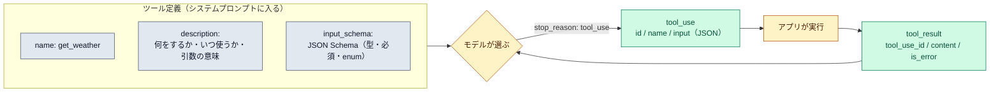

# ツール定義の形

::: tip 要点
1. ツール＝**name・description・input_schema の JSON**。モデルは description を読んで「いつ使うか」を決め、input_schema（JSON Schema）に合う引数を返す。**description の詳しさが性能をいちばん左右する**
2. 呼び出しは `tool_use` ブロック（id・name・input の JSON）で返り、`stop_reason` が `tool_use` になる。結果は `tool_result` ブロック（`tool_use_id` と内容）で次のリクエストに入れる
3. ツール定義は**システムプロンプトに組み込まれる**。だから数が増えるほど文脈を食う。誰が実行するかで3種類ある: 自分で実行する定義、Anthropic が形を決めて自分が実行する定義（bash など）、Anthropic 側で実行される定義（web_search など）
:::

## 定義の3項目

| 項目 | 何を書くか |
|---|---|
| `name` | 英数字と `_` `-`。サービスをまたぐなら `github_list_prs` のように接頭辞を付ける |
| `description` | 何をするか、**いつ使うか（使わないか）**、各引数の意味、返さないものや制約。3〜4文以上 |
| `input_schema` | 引数の JSON Schema。型、必須、`enum` で選択肢 |

公式が「**性能をいちばん左右する**」と言うのは description。モデルはこれを読んで、いま呼ぶべきかを
判断する。「株価を返す」だけの説明と、「NYSE/NASDAQ の銘柄コードを受け取り USD の最新約定価格を返す。
会社の他の情報は返さない」という説明では、選び方の精度が変わる。

定義は API が組み立てる**システムプロンプトの一部**になる。[コンテキスト](./context-window.md)を
食うのはそのため。[MCP](./mcp.md) のスキーマが既定で後回しにされるのも、この費用を避けるため。

## 呼び出しと結果の形

モデルがツールを使うと決めると、応答に `tool_use` ブロックが入り、`stop_reason` が `tool_use` になる。

- `tool_use`: `id`（この呼び出しの識別子）、`name`、`input`（スキーマに沿った JSON）
- アプリが実行し、結果を `tool_result` ブロックにして次のリクエストの user メッセージに入れる。
  `tool_use_id` で対応づけ、失敗なら `is_error` を付ける

これが[エージェントループ](../guide/agent-loop.md)の1周。**モデルは何も実行しない。** 構造化された
依頼を出し、結果を読むだけ。1つの応答に `tool_use` が複数入ることもあり（並列呼び出し）、
その場合は結果もまとめて1つの user メッセージで返す。

## 誰が実行するか

| 種類 | 形を決めるのは | 実行するのは | 例 |
|---|---|---|---|
| 自分で定義するツール | 自分 | 自分のアプリ | データベース検索、社内 API |
| Anthropic スキーマのツール | Anthropic | 自分のアプリ | bash、text_editor、computer |
| サーバー側ツール | Anthropic | Anthropic のサーバー | web_search、web_fetch、code_execution |

Anthropic スキーマのツールは**その形で大量に訓練されている**ので、同じ機能を自分で定義するより
確実に呼ばれ、失敗からの立て直しもうまい。Claude Code の Bash や Edit がその例。

## 自分で確かめる

- Claude Code のツールも同じ形。`/context` の「ツール定義」がその合計
- `tool_choice` で「自動で選ぶ／必ずどれか使う／このツールを使う／使わない」を指定できる（モデルにより制限あり）
- 一部のモデルでは `strict: true` を付けると、引数がスキーマに厳密に従うことが保証される

---

最終確認: **2026-09-13**

出典:

- [Define tools — Claude API](https://platform.claude.com/docs/en/agents-and-tools/tool-use/define-tools)（3項目、description が最重要、システムプロンプトへの組み込み、`tool_choice`、応答の `tool_use` ブロックの形）
- [How tool use works — Claude API](https://platform.claude.com/docs/en/agents-and-tools/tool-use/how-tool-use-works)（契約としてのツール使用、実行する場所の3種類、`stop_reason` で回るループ、`tool_result`）
