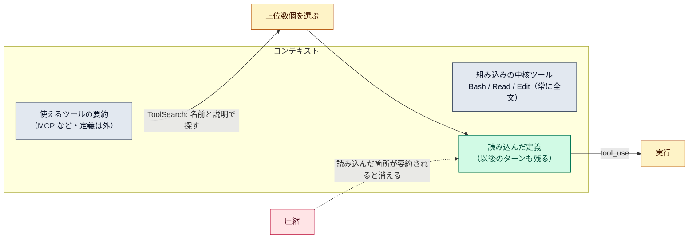

# ツール探索（ToolSearch）

::: tip 要点
1. ツール探索＝**ツール定義を文脈から外しておき、必要なものだけ探して読み込む**仕組み。起動時に入るのは「どんなツールがあるか」の要約だけ。[MCP](./mcp.md) を何十個繋いでも文脈が太らない理由の本体
2. Claude が「今の作業にこのツールが要る」と判断すると `ToolSearch` で名前と説明から探し、上位数個の定義が文脈に入る。**入った定義は以後のターンでも残る**。その箇所が[圧縮](./compaction.md)で要約されると消え、次に要るときまた探す
3. 代償は**探すたびに1往復増える**こと。ツールが10個程度で定義が小さいなら、全部先に読むほうが速い。既定は有効で、`ENABLE_TOOL_SEARCH` で変えられる（`auto` なら定義が文脈の一定割合に達したときだけ有効）
:::

## 何が起きているか

[ツール定義](./tool-definitions.md)はシステムプロンプトに入るので、数が増えるほど文脈を食う。
公式の数字では 50 個で 1〜2 万トークン。さらに、**30〜50 個を超えると選択の精度も落ちる**。

ツール探索はこれを「定義を外に置く」ことで解く。起動時に文脈に入るのは、使えるツールの**要約**だけ。
Claude は作業中に「まだ読み込んでいない能力が要る」と判断すると `ToolSearch` を呼び、ツールの
**名前と説明**に対する検索で候補を得る。上位数個（既定は5個）の定義が文脈に入り、それで `tool_use` を出せる。

## 何が対象で、何が残るか

| もの | 扱い |
|---|---|
| 組み込みの中核ツール（Bash、Read、Edit など） | 常に先に全文が入る。探索の対象外 |
| MCP ツール、必要時に読む組み込みツール | 既定で遅延。要約だけ入り、探して読み込む |
| `alwaysLoad` を付けた MCP サーバー | 遅延の例外。最初から全文 |
| 読み込んだ定義 | 以後のターンでも残る。読み込んだ箇所が圧縮で要約されると消え、次に要るときまた探す |

探しやすさは**名前と説明**で決まる。`search_slack_messages` は `query_slack` より多くの依頼に引っかかり、
「チャンネル・日付・キーワードで Slack を検索」という説明は「Slack を問い合わせる」より当たりやすい。
[ツール定義の形](./tool-definitions.md)で「説明が最重要」と書いたのは、ここでも効く。

## いつ効かず、どう変えるか

- **代償**は探すたびの1往復。ツールが10個程度で定義が小さいなら、全部先に読むほうが速い
- 効かない構成: 古い世代のモデル、一部のプロキシ経由（`tool_reference` ブロックを通さない）、非対応のホスティング。その場合は全定義が毎回入る
- `ENABLE_TOOL_SEARCH`: 未設定で有効、`false` で全部先読み、`auto` で「遅延できる定義が文脈の 10% に達したら有効」（`auto:5` で 5%）

## 自分で確かめる

- `/context` で「MCP tools」の欄を見る。遅延されていれば小さい
- 転記ビューア（`Ctrl+O`）で `ToolSearch` の呼び出しが見える。何を探して何が入ったかが分かる
- このサイトを書いている Claude Code でも、MCP ツールは `ToolSearch` で読み込んでから使っている

---

最終確認: **2026-09-13**

出典:

- [Scale to many tools with tool search — Agent SDK](https://code.claude.com/docs/en/agent-sdk/tool-search)（仕組み、要約だけ入ること、上位5個、圧縮後の扱い、1往復の代償、`ENABLE_TOOL_SEARCH` の値、中核ツールは対象外、名前と説明の書き方）
- [Explore the context window — Claude Code](https://code.claude.com/docs/en/context-window)（起動時は MCP ツールの名前だけ入ること）
