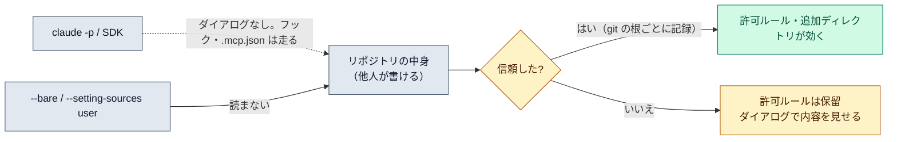

# ワークスペースの信頼

::: tip 要点
1. **リポジトリの中身は他人が書けるものなので、Claude Code はそれを「信頼してから」効かせる。** 初めてのフォルダでは信頼ダイアログが出て、プロジェクト設定が何を許可しようとしているかを見せる
2. 信頼するまで使われないのは、プロジェクトの `.claude/settings.json` の**許可ルールと追加ディレクトリ**、サブエージェントの frontmatter のフックや MCP など。一方でプロジェクトの**フックと `.mcp.json` は親フォルダを信頼していれば走る**（MCP は接続前に聞かれる）
3. `claude -p` と SDK は**ダイアログを出さない**。知らないリポジトリで走らせるなら `--bare` か `--setting-sources user` で、リポジトリのフック・MCP・スキルを読まないようにする
:::

## なぜ信頼という段階があるか

[設定](./settings-layers.md)のうちプロジェクトの `.claude/settings.json` と `.mcp.json` は **git で共有される**。
つまり、クローンしたリポジトリの誰かが書いたものが、自分のマシンで Claude Code の権限を広げたり、
サーバーを起動したりできる。それを防ぐため、Claude Code は「このフォルダの中身を信頼するか」を
初回に聞き、**能力を広げる設定はその承認まで保留**する。

信頼は **git リポジトリの根**ごとに記録される（サブモジュールは別）。リポジトリの外では起動した
ディレクトリごと。ホームディレクトリで起動したときは、そのセッション限りで記録されない。

## 何が保留され、何が走るか

| リポジトリが持ち込むもの | 親フォルダだけ信頼したとき | `-p` / SDK |
|---|---|---|
| 設定ファイルのフック、`env`、補助コマンド、スキルのフックと `allowed-tools` | **走る** | **走る** |
| `.claude/settings.json` の `permissions.allow` と追加ディレクトリ | 保留。ダイアログが内容を見せる | 保留。ダイアログは出ない |
| サブエージェントの frontmatter のフック・インライン MCP | 使われない | 使われない |
| `.mcp.json` のサーバー | 接続前に聞かれる | 聞かれずに接続 |

`.claude/settings.local.json` は普段は自分のファイルだが、git で追跡されていれば「リポジトリ由来」として
同じく保留になる。

## 人がいないときの守り

`-p` はダイアログを出さない。**書いたことのないリポジトリで `-p` を走らせるなら、何を走らせるかを先に決める。**

- `--bare`: フック・スキル・サブエージェント・プラグイン・`.mcp.json` を読まない（[非対話モード](../guide/headless.md)）
- `--setting-sources user`: プロジェクトの設定ファイルも `.mcp.json` も読まない

これはプロンプトインジェクションの話とも繋がる。リポジトリの中身、Issue の本文、取得した Web ページは
すべて「他人が書いた文章」で、指示のように見えることがある。Claude Code 側の守りは、[パーミッション](../guide/permission-modes.md)、
[サンドボックス](./sandboxing.md)、Web 取得を[別の文脈](./subagents.md)で読むこと、初回の信頼確認。
それでも「提案されたコマンドを見る」「信頼できない内容を直接流し込まない」は人の仕事。

## 自分で確かめる

- 初めてのフォルダで `claude` を起動すると信頼ダイアログが出る。断れば保留のまま
- `/permissions` で、効いているルールがどのファイル由来かを見る。保留中のルールは警告に出る
- `/status` で、管理設定がどこから来ているか

---

最終確認: **2026-09-13**

出典:

- [Configure permissions — Claude Code](https://code.claude.com/docs/en/permissions)（「Project allow rules and workspace trust」「What runs before you trust a folder」節。信頼の単位、保留されるもの・走るものの表、`-p` の扱い、`--bare` と `--setting-sources`）
- [Security — Claude Code](https://code.claude.com/docs/en/security)（初回の信頼確認、`-p` では無効、プロンプトインジェクションへの守りと人の側の注意）
