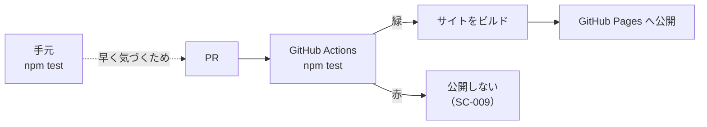

# 契約: 完了条件の検査

**最終確認: 2026-09-12** / 背景は [ADR-0005](../../../docs/adr/0005-page-completion-check.md)。

FR-023 / SC-002 / SC-009 を満たす機械検査。**Vitest のテストとして実装し、`npm test` で走る。**

## 入口

```ts
// src/check/page.ts — 純関数。ファイル読み込みは呼び出し側の責務
export interface PageInput {
  path: string            // リポジトリからの相対パス
  frontmatter: unknown    // パース済み YAML（信用しない。ここで検証する）
  body: string            // frontmatter を除いた本文
}

export interface Violation {
  path: string
  rule: string            // 'quiz-count' | 'answer-range' | 'last-verified' | 'source-link' | 'quiz-id' | ...
  message: string         // 日本語。何を直せばよいかが分かる文
}

export function checkPage(input: PageInput): Violation[]
export function checkSite(inputs: PageInput[]): Violation[]   // quizId の重複など、横断の検査を含む
```

**`checkPage` はページ単体の規則**、**`checkSite` は横断の規則**（`quizId` の重複、目次との整合）を見る。

## 検査する規則

[contracts/page-frontmatter.md](./page-frontmatter.md) の表がそのまま規則の一覧。加えて横断で:

| 規則 | 内容 |
|---|---|
| `quiz-id-duplicate` | 2つ以上のページが同じ `quizId` を持つ |
| `question-id-collision` | 同一ページ内で `questionId` が衝突する（実質起きないが、起きたら成績が混ざる） |
| `orphan-link` | 目次からリンクされているのに、上のどれかを満たさないページがある（FR-005） |

## 失敗の見え方

**違反は1件で止めず、全部集めてから落とす。** 1つ直すたびに CI を回し直すのは続かない。

```
✗ docs/guide/agent-loop.md
    quiz-count      クイズが 2 問しかありません（3問必要）
    source-link     本文に外部リンクがありません（出典・FR-007）
✗ docs/internals/tools.md
    last-verified   lastVerified がありません

2ページで 3 件の違反。公開しません。
```

## いつ走るか



**保証は CI 側にある。** 手元のフックは `--no-verify` ですり抜けられるため、保証には数えない。
