# 契約: ページの frontmatter

**最終確認: 2026-09-12** / 背景は [ADR-0004](../../../docs/adr/0004-quiz-data-model.md)。

これは**ページを書く自分と、検査・表示のコードとの間の契約**。ここを満たさないページは公開されない。

## 形

````markdown
---
title: エージェントループ
quizId: agent-loop
lastVerified: 2026-09-12
quiz:
  - q: エージェントループで、ツールの実行結果は次にどこへ渡るか
    choices:
      - モデルへの入力
      - ユーザーの画面
      - ログファイル
      - 破棄される
    answer: 0
  - q: （2問目）
    choices: [ア, イ, ウ, エ]
    answer: 2
  - q: （3問目）
    choices: [ア, イ, ウ, エ]
    answer: 1
---

# エージェントループ

::: tip 要点
1. 要点1
2. 要点2
3. 要点3
:::

```mermaid
flowchart LR
  ...
  %% 箱の色は「役割」で決める（サイト共通・ADR-0008）
  %% fixed=毎回入るもの・入力 / accum=積もるもの・処理中 / result=戻るもの・結果 / edge=境界・特別な操作
  classDef fixed fill:#e2e8f0,stroke:#475569,color:#0f172a
  classDef accum fill:#fef3c7,stroke:#b45309,color:#451a03
  classDef result fill:#d1fae5,stroke:#047857,color:#064e3b
  classDef edge fill:#ffe4e6,stroke:#be123c,color:#4c0519
  class P fixed
```



対比の表は見出しを `<span class="keep">残る</span>` / `<span class="gone">消えうる</span>` で色分けする。

本文。変化しうる記述には出典リンクを添える（[公式ドキュメント](https://docs.claude.com/)）。
````

## 規則

| キー | 型 | 規則 | 破ったときのメッセージ（例） |
|---|---|---|---|
| `title` | string | 空でない | `title がありません` |
| `quizId` | string | `^[a-z0-9-]+$` / **サイト全体で一意** | `quizId "agent-loop" が docs/guide/a.md と重複しています` |
| `lastVerified` | string | `^\d{4}-\d{2}-\d{2}$` / 実在する日付 | `lastVerified が YYYY-MM-DD 形式ではありません` |
| `quiz` | array | **ちょうど3件** | `クイズが 2 問しかありません（3問必要）` |
| `quiz[].q` | string | 空でない / ページ内で重複しない | `1問目の q が空です` |
| `quiz[].choices` | string[] | **ちょうど4件** / 各要素が空でない | `2問目の choices が 3 件です（4件必要）` |
| `quiz[].answer` | number | 整数 / `0 <= answer <= 3` | `3問目の answer が 4 です（0〜3）` |

## 本文側の規則

| 規則 | 検査 |
|---|---|
| 外部リンクを1本以上含む（出典・FR-007） | **する** |
| Mermaid 図を含む（憲法 II） | **しない**（人が守る） |
| 図の箱は役割色（fixed / accum / result / edge）で塗る | **しない**（人が守る） |
| 要点3行・1ページ1概念・スクロール3画面以内 | **しない**（人が守る） |

検査する／しないの線引きの理由は [ADR-0005](../../../docs/adr/0005-page-completion-check.md)。

## 検査の対象外にするページ

目次（`docs/index.md`）など、解説ページでないものは検査しない。
**除外は frontmatter の `quizExempt: true` で明示する。** 対象外をパスの一覧で持つと、
ファイルを移動したときに黙って検査から外れるため。
