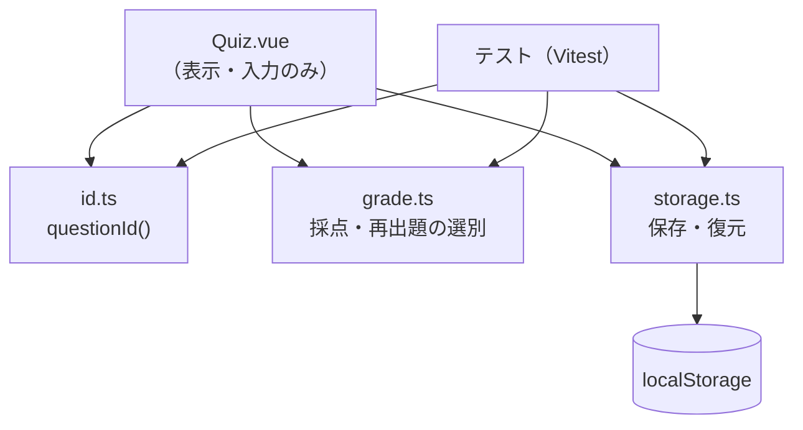

# 契約: クイズのロジック（素の TS モジュール）

**最終確認: 2026-09-12**

憲法 IV に従い、**ロジックは Vue から切り離した素の TS に置き、単体テストを書く**。
Vue コンポーネントは「表示と入力」だけを持つ薄い層にする。



## `src/quiz/id.ts`

```ts
/** 問題文のテキストだけから設問の識別子を作る。同期。同じ入力なら必ず同じ出力。 */
export function questionId(questionText: string): string
```

- 正規化: NFC → trim → 連続空白を半角スペース1つに
- FNV-1a（32bit）→ 8桁の16進小文字
- `choices` と `answer` は**材料に含めない**（[ADR-0004](../../../docs/adr/0004-quiz-data-model.md)）

## `src/quiz/grade.ts`

```ts
export interface Question { q: string; choices: string[]; answer: number }
export type Answers = Record<string, boolean>   // questionId → 正誤

/** 1問の採点。選んだ添字が answer と一致するか。 */
export function isCorrect(question: Question, chosenIndex: number): boolean

/** 3問ぶんの結果から「何問正解か」を出す（FR-013）。 */
export function score(questions: Question[], answers: Answers): { correct: number; total: number }

/** 再出題の対象（＝記録が false の設問）。全問正解なら空配列 → 導線を出さない（FR-017）。 */
export function questionsToRetry(questions: Question[], answers: Answers): Question[]

/** 未回答の設問（FR: 未回答のまま採点しようとしたときに示す）。 */
export function unanswered(questions: Question[], answers: Answers): Question[]
```

## `src/quiz/storage.ts`

```ts
export const STORAGE_KEY = 'claude-study:quiz:v1'

/** テスト時に差し替えるための最小の口。localStorage はこの形を満たす。 */
export interface KeyValueStore {
  getItem(key: string): string | null
  setItem(key: string, value: string): void
}

/** 読めない・壊れている・版が違うときは空を返す。例外を投げない。 */
export function loadAnswers(store: KeyValueStore | null, quizId: string): Answers

/** 保存できないときは黙って何もしない。例外を投げない（FR-020）。 */
export function saveAnswer(
  store: KeyValueStore | null,
  quizId: string,
  questionId: string,
  correct: boolean
): void
```

**`store` に `null` を渡せる**のが要点。プライベートウィンドウなどで `localStorage` に触れない環境を、
**分岐ではなく引数で表す**。こうするとテストで「保存が使えない環境」をそのまま再現できる（SC-005）。

## テストの要件（憲法 IV: Red → Green）

**実装より先に、失敗するテストを書く。** 最低限これらを覆う。

| 対象 | 確かめること |
|---|---|
| `questionId` | 同じ問題文 → 同じ値 / 前後の空白違いは同じ値 / 1文字違えば別の値 / 選択肢を変えても同じ値 |
| `isCorrect` | 正解・不正解 |
| `score` | 3問中2問正解 → `{correct:2,total:3}` |
| `questionsToRetry` | 不正解だけ返る / 全問正解なら空 |
| `loadAnswers` | 空のとき / 壊れた JSON のとき / 版違いのとき → いずれも空を返し、例外を投げない |
| `saveAnswer` | 保存される / `null` ストアでも例外を投げない / 例外を投げるストアでも落ちない |
| `checkPage` | [contracts/page-check.md](./page-check.md) の規則それぞれに、落ちる例と通る例 |
