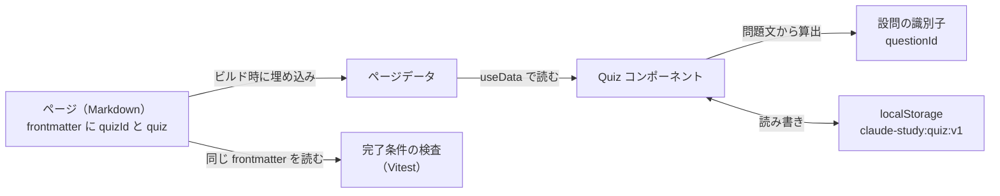
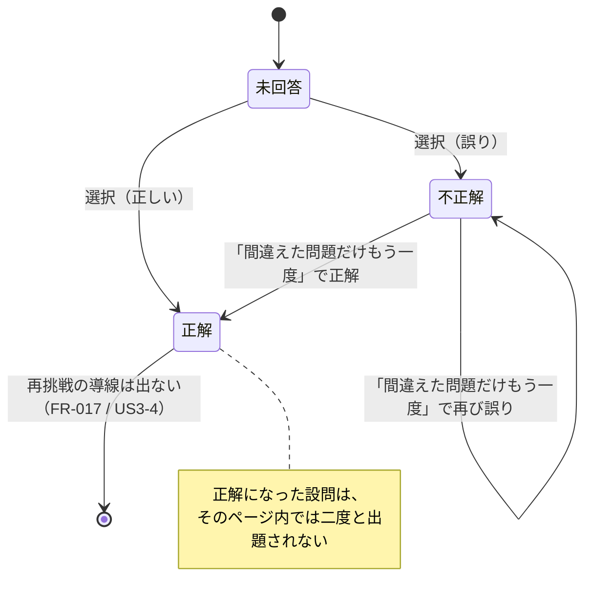

# データモデル: 学習ノートサイト — 1本目のページ

**最終確認: 2026-09-12** / 決定の背景は [ADR-0004](../../docs/adr/0004-quiz-data-model.md) が所有する。



## 1. ページ（Page）

**実体**: `docs/` 配下の Markdown ファイル1つ。

| フィールド | 場所 | 必須 | 規則 |
|---|---|---|---|
| `title` | frontmatter | ○ | 1行 |
| `quizId` | frontmatter | ○ | 英小文字・数字・ハイフンのみ。**サイト全体で一意** |
| `lastVerified` | frontmatter | ○ | `YYYY-MM-DD`。実在する日付 |
| `quiz` | frontmatter | ○ | 設問**ちょうど3件**（→ 2.） |
| 本文 | 本文 | ○ | 外部リンクを**1本以上**含む（出典・FR-007） |
| 図 | 本文 | ○ | ` ```mermaid ` フェンス。**機械検査はしない**（憲法 II は人が守る） |

**検査されない規則**（憲法 II / FR-004 — 人が公開前に見る）: 1ページ1概念、本文はスクロール3画面以内、
冒頭の要点3行。理由は [ADR-0005](../../docs/adr/0005-page-completion-check.md)。

**状態**: ページに「下書き／公開」の区別は持たせない。**目次からリンクされていれば公開、されていなければ未着手**
（FR-005 / FR-021）。フラグを増やすと「公開のつもりで下書きのまま」が起きるため。

## 2. 設問（Question）

**実体**: `quiz` 配列の1要素。

| フィールド | 型 | 規則 |
|---|---|---|
| `q` | string | 問題文。**空でない**。ページ内で重複しない |
| `choices` | string[] | **ちょうど4件**。各要素は空でない |
| `answer` | number | `choices` の添字。**0〜3** |

**識別子 `questionId`**: `q` のテキストだけから算出する純関数の出力。`choices` と `answer` は材料に含めない
（[ADR-0004](../../docs/adr/0004-quiz-data-model.md)）。

- 正規化: Unicode NFC → 前後の空白を除去 → 連続する空白を半角スペース1つに畳む
- ハッシュ: FNV-1a（32bit）→ 8桁の16進文字列
- **同期関数**であること（`crypto.subtle` は非同期のため使わない）
- 同じ文字列からは、ブラウザでもテストでも**必ず同じ値**が出る

衝突: 1ページ3問の範囲でしか衝突しえない。**同一ページ内で `questionId` が衝突した場合は検査で落とす**。

## 3. 成績記録（ProgressRecord）

**実体**: 読者の端末の `localStorage`。外部へは出ない（FR-014 / SC-006）。

- キー: `claude-study:quiz:v1`（**1キーに全ページぶん**をまとめる）
- 値: JSON

```json
{
  "version": 1,
  "pages": {
    "agent-loop": { "a3f9c2d1": true, "7b1e0455": false, "0c9d3a10": true }
  }
}
```

| 階層 | 意味 |
|---|---|
| `version` | 保存形式の版。現在 1 |
| `pages` のキー | ページの `quizId` |
| その中のキー | 設問の `questionId` |
| 値 | **最新の正誤のみ**（`true` / `false`）。履歴は持たない（FR-015） |

**記録が存在しない = 未回答。** 「未回答」を表す値は持たない（キーの有無で表す）。

### 状態の移り変わり（1つの設問）



**正解からは戻らない。** 一度正解した設問を再出題する導線は作らない（spec の Assumptions）。

### 壊れた記録・古い形式の扱い（Edge Cases）

| 状況 | ふるまい |
|---|---|
| キーが無い | 全問未回答として開始 |
| JSON として読めない | **記録全体を無視**して未回答から開始。エラーを表示しない |
| `version` が 1 でない | 同上（将来の移行が必要になった時点で ADR を書く） |
| `localStorage` の読み書きが例外を投げる | 例外を飲み込み、**その場限りの記憶**で最後まで動く（FR-020 / SC-005） |
| 設問を編集して `questionId` が変わった | 古いキーは参照されなくなる。**消さずに残す**（他ページの記録を壊す危険を避ける） |
| 複数タブで別々に回答 | **後から保存したほうが残る**。同期はしない |

## 4. 検査結果（CheckResult）— 実行時には存在しない

完了条件の検査（[ADR-0005](../../docs/adr/0005-page-completion-check.md)）がページごとに作る内部の値。
サイトには出ない。**失敗したページのパスと、満たさなかった規則の一覧**を持つ。
検査の詳細は [contracts/page-check.md](./contracts/page-check.md)。
