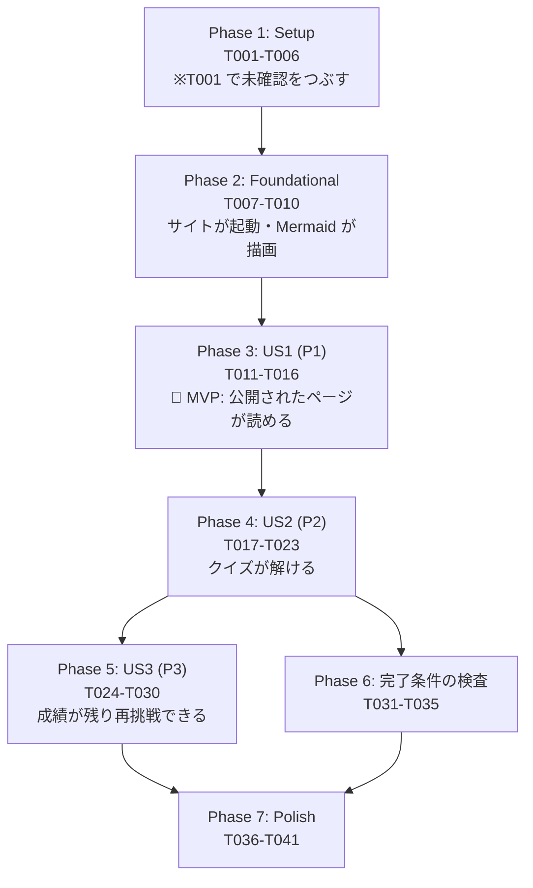

# Tasks: 学習ノートサイト — 1本目のページを公開まで通す

**Input**: `specs/001-learning-site-first-page/` の設計文書

**Prerequisites**: [plan.md](./plan.md) / [spec.md](./spec.md) / [research.md](./research.md) / [data-model.md](./data-model.md) / [contracts/](./contracts/)

**Tests**: **必須。** 憲法 IV が「失敗するテストを先に書く（Red → Green）」「テストが緑でないものはマージしない」と
定めているため、テストタスクは対応する実装タスクの**直前**に置く。

**Organization**: ユーザーストーリー単位。各段階で単独に動作確認できる。

> **このタスク群の実行は Issue #8 の範囲外。** #8 の完了条件は `plan.md` と `tasks.md` があること。
> **実装に着手する前に、新しい Issue を起票する**（`CLAUDE.md` の「タスク管理」節。起票は承認を挟む）。

## Format: `[ID] [P?] [Story] Description`

- **[P]**: 並行してよい（別ファイル・未完了タスクに依存しない）
- **[Story]**: US1 / US2 / US3
- 受け入れの確認は [quickstart.md](./quickstart.md) の S-1〜S-8 に対応する

---

## Phase 1: Setup（土台）

**Purpose**: プロジェクトの初期化。**未確認を最初につぶす。**

- [ ] T001 `package.json` を作り、`vitepress@^1.6.4` / `vitest@^5` / `js-yaml`（検査が frontmatter を読むのに使う）を実際にインストールして**同居が破綻しないことを確かめる**（[research.md](./research.md) U-1）。`npx vitest run`（テスト0件）と `npx vitepress build docs` が両方通ることを確認し、**結果を `research.md` の U-1 に追記して「未確認」から外す**。破綻した場合は `vite` を devDependency で明示的に揃えるなどの対処を行い、対処の内容も U-1 に書く
- [ ] T002 `package.json` に scripts を定義する（`docs:dev` / `docs:build` / `docs:preview` / `test`）。**`npm test` 一本に集約する**（[ADR-0005](../../docs/adr/0005-page-completion-check.md)）
- [ ] T003 [P] `tsconfig.json` を作る（`src/` と `tests/` を対象、`strict: true`）
- [ ] T004 [P] `.gitignore` に `node_modules/` `docs/.vitepress/dist/` `docs/.vitepress/cache/` を追加する
- [ ] T005 [P] `vitest.config.ts` を作る（環境は node、対象は `tests/**/*.test.ts`）
- [ ] T006 `CLAUDE.md` の空の「## Commands」節に dev/build/test のコマンドを書く（コマンドの所有者は `CLAUDE.md`。SSOT 表のとおり）

**チェックポイント**: `npm test` と `npm run docs:build` がどちらも動く（まだ中身は空）

---

## Phase 2: Foundational（全ストーリーの前提）

**Purpose**: サイトが起動し、Mermaid 図が描画される状態。**ここが終わるまでどのストーリーにも着手できない。**

- [ ] T007 `docs/.vitepress/config.ts` を作る（`base: '/claude-study/'`、サイト名、2本柱「使い方」「仕組み」の枠、`srcExclude` で `adr/**` をサイトから除外）
- [ ] T008 `docs/index.md`（目次）を作る。**2本柱の枠だけを置き、未着手のページはリンクしない**（FR-021）。`quizExempt: true` を frontmatter に置く（[contracts/page-frontmatter.md](./contracts/page-frontmatter.md)）
- [ ] T009 `vitepress-plugin-mermaid@^2.0.17` と `mermaid@^11` を入れ、`config.ts` を `withMermaid()` で包む。**`mermaid` を 12 系にしない**（[ADR-0006](../../docs/adr/0006-mermaid-rendering.md)）
- [ ] T010 `docs/index.md` に ` ```mermaid ` の図を一時的に置き、`npm run docs:dev` で空のサイトが立ち上がり、` ```mermaid ` フェンスが**図として描画される**ことを目で確認する（コードのまま出るなら T009 が効いていない）

**チェックポイント**: ローカルでサイトが開き、Mermaid 図が出る

---

## Phase 3: User Story 1 — 公開されたページを読んで概要をつかむ（P1）🎯 MVP

**Goal**: 公開 URL を開くと、要点3行・図・最終確認日・出典があり、3画面で読み終わる1本のページがある。

**Independent Test**: [quickstart.md](./quickstart.md) の **S-3**（ページが読める）と **S-8**（main → 自動で公開）。
クイズが動かなくても、このストーリー単体で価値が成立する。

- [ ] T011 [US1] 「エージェントループ」を**公式ドキュメントで裏取りする**。書ける事実と書けない事実を分け、**[research.md](./research.md) の U-2 を更新する**。裏が取れないことは書かない（憲法 I / spec の Assumptions。薄いページになるのは仕様どおりの結果）
- [ ] T012 [US1] `docs/guide/agent-loop.md` を書く。frontmatter は [contracts/page-frontmatter.md](./contracts/page-frontmatter.md) のとおり（`title` / `quizId: agent-loop` / `lastVerified` / `quiz` 3問）。本文は **要点3行 → Mermaid 図 → 説明 → 出典リンク**。**クイズ3問は frontmatter に書くが、表示は US2 で作る**（先に書いておくことで US2 と検査の両方が同じページで試せる）
- [ ] T013 [US1] `docs/index.md` と `config.ts` のサイドバーから `guide/agent-loop` にリンクする。**「仕組み」は枠だけでリンク先を作らない**（FR-021）
- [ ] T014 [US1] `.github/workflows/deploy.yml` を作る。`npm ci` → **`npm test`** → `npm run docs:build` → `actions/configure-pages` → `actions/upload-pages-artifact`（`docs/.vitepress/dist`）→ `actions/deploy-pages`。**テストが赤なら公開しない**（SC-009）
- [ ] T015 [US1] **【手作業】** GitHub のリポジトリ設定で Pages を有効化する（Settings → Pages → Source を「**GitHub Actions**」に）。2026-09-12 時点で**未設定**（`gh api repos/:owner/:repo/pages` が 404）。**この1手だけはコマンドで終わらない**
- [ ] T016 [US1] S-3 と S-8 を確認する。`https://toshiki0102.github.io/claude-study/` でページが読め、main への取り込みから公開まで手作業が無いこと

**チェックポイント**: **ここで MVP が成立する。** 公開されたページが1本読める

---

## Phase 4: User Story 2 — クイズ3問で理解を確かめる（P2）

**Goal**: ページ末尾で3問に答えられ、その場で正誤と正解が出て、何問正解かが分かる。成績の保存はまだ無い。

**Independent Test**: [quickstart.md](./quickstart.md) の **S-4**。保存が無くても確認できる。

- [ ] T017 [P] [US2] `tests/quiz/id.test.ts` に**失敗するテスト**を書く（[contracts/quiz-modules.md](./contracts/quiz-modules.md) のテスト要件）: 同じ問題文→同じ値／前後と連続の空白違い→同じ値／1文字違い→別の値／**選択肢や正解を変えても同じ値**
- [ ] T018 [P] [US2] `tests/quiz/grade.test.ts` に**失敗するテスト**を書く: `isCorrect` の正誤／`score` が3問中2問正解で `{correct:2,total:3}`／`unanswered` が未回答だけ返す
- [ ] T019 [US2] `src/quiz/id.ts` に `questionId()` を実装して T017 を緑にする（NFC → trim → 連続空白を1つに → FNV-1a 32bit → 8桁16進。**同期関数**。`crypto.subtle` は使わない）
- [ ] T020 [US2] `src/quiz/grade.ts` に `isCorrect` / `score` / `unanswered` を実装して T018 を緑にする
- [ ] T021 [US2] `docs/.vitepress/theme/Quiz.vue` を作る（**表示と入力だけ**の薄い層）。`useData()` で frontmatter の `quiz` を読む／選ぶと正誤を表示（FR-010）／**選び直せない**（FR-011）／誤答なら正解を示す（FR-012）／3問終わったら「3問中 n 問正解」（FR-013）／未回答のまま採点しようとしたらどれが未回答か示す
- [ ] T022 [US2] `docs/.vitepress/theme/index.ts` で `DefaultTheme` を拡張し、**`doc-after` スロットに `Quiz` を差し込む**（[research.md](./research.md) F-4）。`quizExempt: true` のページでは描画しない。**各ページに手で書かせない**（書き忘れが構造的に起きないようにするため）
- [ ] T023 [US2] `npm run docs:dev` で `docs/guide/agent-loop.md` を開き、S-4（回答→正誤→正解→「n問正解」／選び直せない）を確認する

**チェックポイント**: ページ末尾でクイズが解ける（リロードすると消える。それは US3 の担当）

---

## Phase 5: User Story 3 — 間違えた問題だけをやり直す（P3）

**Goal**: 再訪問すると前回の成績が残り、間違えた問題だけ再挑戦できる。全問正解なら導線が出ない。

**Independent Test**: [quickstart.md](./quickstart.md) の **S-5**（残る・絞られる）、**S-6**（保存が使えなくても解ける）、**S-7**（外に送らない）。

- [ ] T024 [US3] `tests/quiz/storage.test.ts` に**失敗するテスト**を書く: 空のとき→空を返す／**壊れた JSON →空を返し例外を投げない**／**`version` が違う→空を返す**／保存できる／**`store` が `null` でも例外を投げない**／**`setItem` が例外を投げるストアでも落ちない**（[data-model.md](./data-model.md) の Edge Cases）
- [ ] T025 [US3] `src/quiz/storage.ts` を実装して T024 を緑にする（キー `claude-study:quiz:v1`、`{version:1, pages:{[quizId]:{[questionId]:boolean}}}`、**最新の正誤のみ・履歴を持たない**（FR-015））
- [ ] T026 [US3] `tests/quiz/grade.test.ts` に `questionsToRetry` の**失敗するテスト**を追加する（不正解だけ返る／全問正解なら空配列）
- [ ] T027 [US3] `src/quiz/grade.ts` に `questionsToRetry` を実装して T026 を緑にする
- [ ] T028 [US3] `Quiz.vue` に復元と保存を組み込む。読み込み時に `loadAnswers()`、回答ごとに `saveAnswer()`。**`localStorage` に触れない環境では `store` に `null` を渡し、その場限りの記憶で最後まで動かす**（FR-020 / SC-005）
- [ ] T029 [US3] `Quiz.vue` に「間違えた問題だけもう一度」を作る。対象は `questionsToRetry()` の結果。**全問正解のときは導線を出さない**（US3-4）。**一度正解した設問は再出題しない**
- [ ] T030 [US3] `docs/guide/agent-loop.md` を開いて S-5 / S-6 / S-7 を確認する（S-6 はプライベートウィンドウで）。とくに S-7（Network タブで**リクエスト0件**）は FR-014 / SC-006 の確認そのもの

**チェックポイント**: 3つのユーザーストーリーがすべて動く

---

## Phase 6: 完了条件の機械検査（FR-023 / SC-002 / SC-009）

**Purpose**: 未完成のページが公開されないようにする。**ここが無いと SC-002 と SC-009 が「気をつける」に戻る。**
契約は [contracts/page-check.md](./contracts/page-check.md)。背景は [ADR-0005](../../docs/adr/0005-page-completion-check.md)。

- [ ] T031 [P] `tests/check/page.test.ts` に**失敗するテスト**を書く。[contracts/page-frontmatter.md](./contracts/page-frontmatter.md) の規則**それぞれに、落ちる例と通る例の両方**（`title` 欠落／`quizId` の形式違反／`lastVerified` の形式違反／クイズが2問／`choices` が3件／`answer` が 4／`q` が空／本文に外部リンクが無い／`quizExempt: true` は検査しない）
- [ ] T032 `src/check/page.ts` に `checkPage()` を実装して T031 を緑にする。**純関数**（ファイル読み込みは呼び出し側）。違反は `{path, rule, message}` の配列で返し、**1件目で止めない**
- [ ] T033 `src/check/page.ts` に `checkSite()` を実装する（横断の規則: `quiz-id-duplicate` / `question-id-collision` / `orphan-link` = 目次からリンクされているのに完了条件を満たさないページ）。対応する失敗するテストを `tests/check/page.test.ts` に**先に**足す
- [ ] T034 `tests/pages.test.ts` を作る。`docs/**/*.md` を実際に走査し、frontmatter をパースして `checkPage` / `checkSite` にかける。**違反を全部集めてから、どのファイルの何が足りないかを日本語で出して落ちる**
- [ ] T035 S-2 を確認する。`docs/guide/agent-loop.md` の `quiz` をわざと2問に減らし、`npm test` が**赤**になり、`quiz-count  クイズが 2 問しかありません（3問必要）` のように出ることを確認してから元に戻す

**チェックポイント**: 未完成のページを公開しようとすると CI が止める

---

## Phase 7: Polish（仕上げ・横断）

- [ ] T036 [P] [research.md](./research.md) の U-1 / U-2 を最終確認する。**解決したものは事実として書き直し、残ったものは「未確認」と明示したまま残す**（憲法 I。分からないことを分かったことにしない）
- [ ] T037 [P] `CLAUDE.md` の「## Commands」節が実際に動くコマンドと一致しているか確かめる（書いた時点から変わっていないか）
- [ ] T038 [P] Issue #8 本文の「FR-021（設問の識別）」を **FR-019** に直す（spec.md では FR-021 は目次の要件）
- [ ] T039 `docs/guide/agent-loop.md` の**本文がスクロール3画面に収まっているか目で確認する**（憲法 II / FR-004）。機械検査しないと決めた分、ここは人が担保する（[ADR-0005](../../docs/adr/0005-page-completion-check.md)）。超えていればページを分割する
- [ ] T040 `docs/guide/agent-loop.md` の**3問がそのページの本文だけで答えられるか**を確認する（FR-009 / 憲法 III）。外部知識が要る設問は作り直す。機械検査しないと決めた分、ここも人が担保する
- [ ] T041 [quickstart.md](./quickstart.md) の **S-1 から S-8 を通しで実行**し、全部確認できたことをもって完了とする。1つでも未確認なら「たぶん動く」であって「動いた」ではない

---

## Dependencies



| 依存 | 理由 |
|---|---|
| Phase 2 → Phase 1 | サイトを起動するには依存関係とスクリプトが要る |
| US1 → Phase 2 | ページを置く場所（config・目次）が要る |
| US2 → US1 | 問う対象の本文が無いとクイズが成立しない（spec の Why this priority） |
| US3 → US2 | 採点が動いていないと成績を保存できない |
| Phase 6 → US2 | 検査する対象（frontmatter のクイズ3問）が揃ってから |
| **T019 → T017** / **T020 → T018** / **T025 → T024** / **T027 → T026** / **T032 → T031** | **Red → Green。テストが先**（憲法 IV） |

## 並行してよいもの

```text
Phase 1:  T003 / T004 / T005 は同時（別ファイル、互いに依存しない）
Phase 4:  T017 と T018 は同時（テストファイルが別）
Phase 7:  T036 / T037 / T038 は同時
```

**並行にできない代表**: T021 → T028 → T029 は**すべて `Quiz.vue` を触る**ため直列。

## 各ストーリーの独立テスト基準

| Story | 単独で確認できること | quickstart |
|---|---|---|
| **US1 (P1)** | 公開 URL でページが読める。要点3行・図・最終確認日・出典がある。未着手ページへのリンクが無い | S-3 / S-8 |
| **US2 (P2)** | 3問に答えられ、正誤・正解・「n問正解」が出る。**保存が無くても成立** | S-4 |
| **US3 (P3)** | リロードで成績が残る。間違えた問題だけ再挑戦。保存が使えなくても解ける。外部送信0件 | S-5 / S-6 / S-7 |

## Implementation Strategy

**MVP = Phase 1 + Phase 2 + Phase 3（T001〜T016）。** ここまでで「公開されたページが1本読める」が成立する。
spec の US1 が「これ単体で価値が成立する最小の塊」と書いているとおり、**クイズが無くても公開する価値がある**。

そのあとは US2 → US3 → 検査 の順に足す。**Phase 6（検査）を最後に回さないこと**を勧める。
ページが2本目に入る前に門番を立てておかないと、守る対象が増えてから守り方を作ることになる。

**タスク総数: 41**（Setup 6 / Foundational 4 / US1 6 / US2 7 / US3 7 / 検査 5 / Polish 6）
